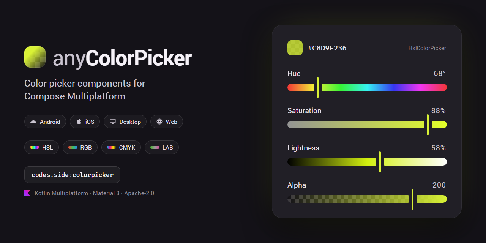
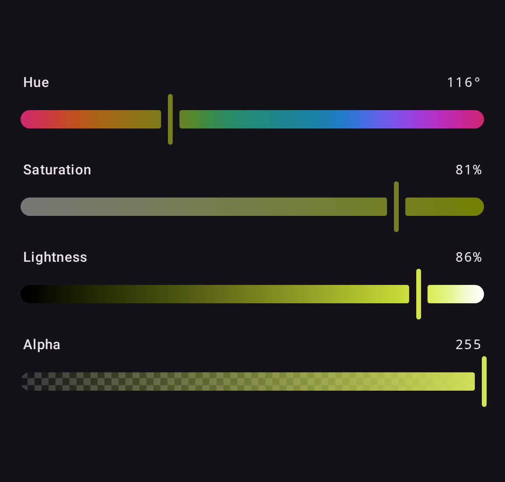
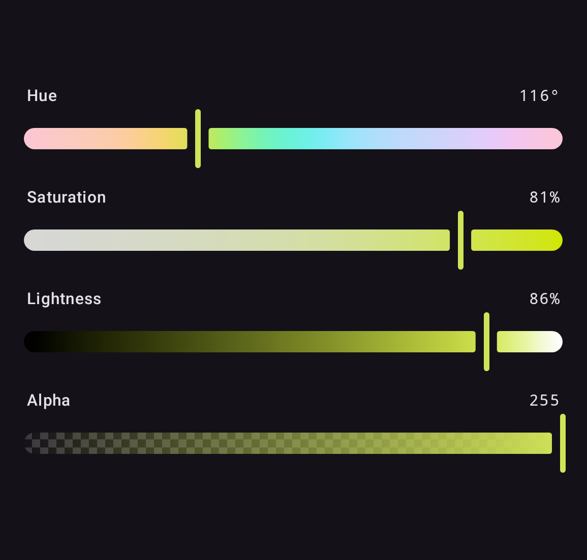
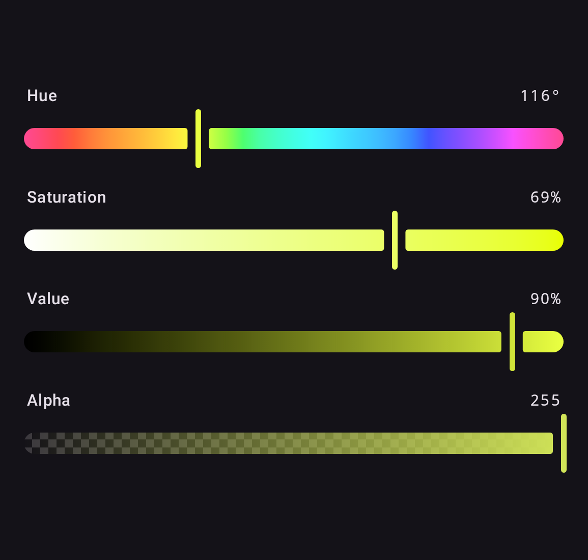
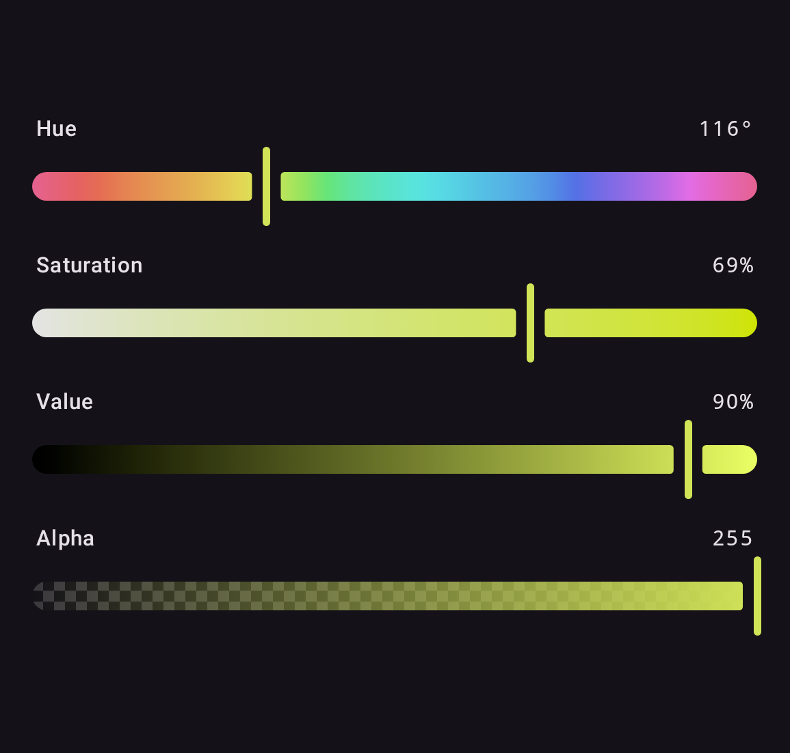
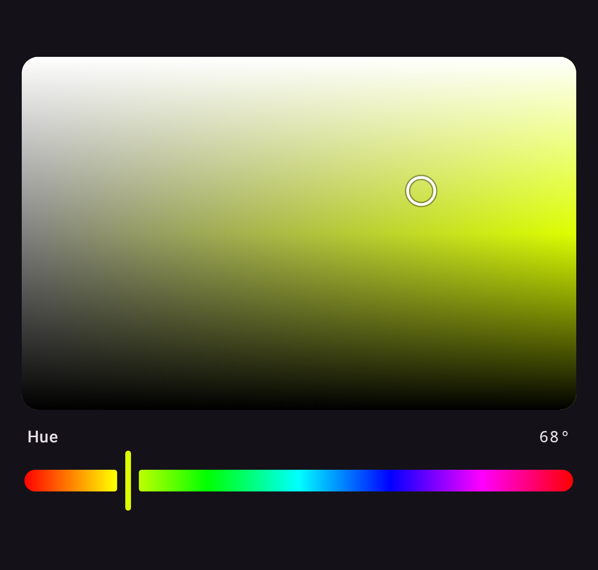
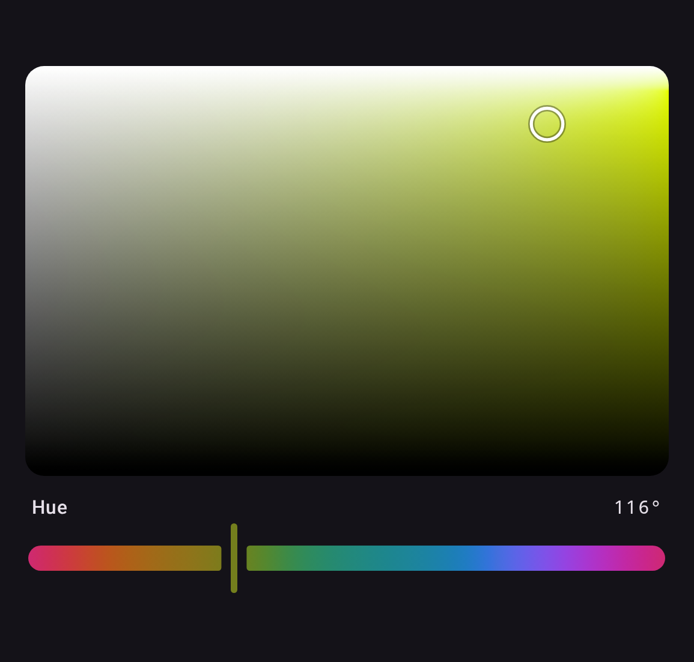
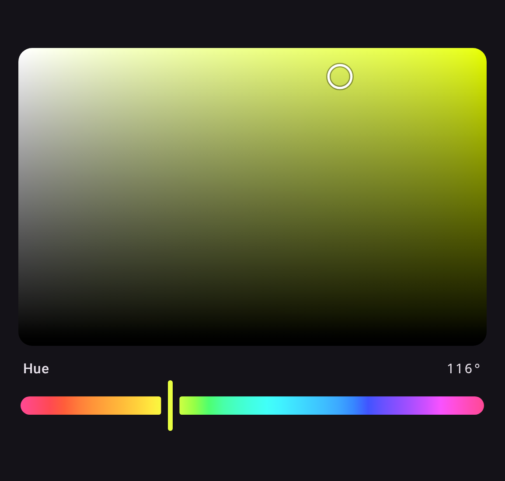

# anyColorPicker — Compose Multiplatform Color Picker

Kotlin Multiplatform color picker library for Android, iOS, Desktop (JVM), and Web (Wasm), built with Compose Multiplatform and Material 3.

## ✨ Features

- Compose Multiplatform (Android, iOS, Desktop/JVM, Web/Wasm)
- Material 3 theming via `ColorPickerDefaults`
- HSL, RGB, CMYK, and LAB color models
- Perceptual color: Okhsl and Okhsv pickers, with Oklab and OkLCh for interchange and manipulation
- CSS Color 4 gamut mapping, so an out-of-gamut LAB, Oklab or OkLCh color keeps its lightness and hue
- Alpha channel support
- Zero-drift editing: `ColorPickerState` keeps the authoritative color in the space you edited, so edit-in-X-read-X is always exact (conversions themselves are float-based)
- Unidirectional data flow with `ColorPickerState`
- Hex string parsing and formatting
- Color picker dialog
- Two-dimensional color planes — saturation paired with lightness or value — alongside the single-channel sliders
- Accessibility semantics throughout — the planes take focus, move with the arrow keys, and offer a screen reader one named action per direction
- RTL layout support everywhere but the planes, which map a color space rather than showing progress

## 📦 Setup

```kotlin
// build.gradle.kts
implementation("codes.side:colorpicker:1.2.1")
```

In a Kotlin Multiplatform project, add it to `commonMain`:

```kotlin
kotlin {
    sourceSets {
        commonMain.dependencies {
            implementation("codes.side:colorpicker:1.2.1")
        }
    }
}
```

Published targets: `android`, `jvm`, `iosArm64`, `iosSimulatorArm64`, `wasmJs`.

## 🎨 Gallery

Every picker takes a `ColoringMode`. `Independent` shows each channel's full range;
`Contextual` previews the resulting color at every slider position. `HslColorPicker`,
`OkhslColorPicker` and `OkhsvColorPicker` default to `Independent`; the RGB, CMYK and LAB
pickers default to `Contextual`.

| Model                           | Independent                                        | Contextual                                       |
|---------------------------------|----------------------------------------------------|--------------------------------------------------|
| **HSL**<br>`HslColorPicker`     |      |      |
| **RGB**<br>`RgbColorPicker`     |      |      |
| **CMYK**<br>`CmykColorPicker`   |    |    |
| **LAB**<br>`LabColorPicker`     |      |      |
| **Okhsl**<br>`OkhslColorPicker` |  |  |
| **Okhsv**<br>`OkhsvColorPicker` |  |  |

`ColorSwatch` draws the color over a transparency checkerboard, so alpha reads correctly:


These images are the Compose Preview Screenshot Testing references, rendered from the
library's own components and re-checked on every CI run, so they cannot drift from what
the code actually draws. Regenerate them with
`./gradlew :screenshot-tests:updateDebugScreenshotTest`.

## 🚀 Quick Start

```kotlin
@Composable
fun MyScreen() {
    val state = rememberColorPickerState(
        initialColor = HslColor(hue = 200f, saturation = 0.8f, lightness = 0.5f)
    )

    Column {
        HslColorPicker(state = state)
        ColorSwatch(
            color = state.hslColor.toComposeColor(),
            modifier = Modifier.size(48.dp)
        )
    }
}
```

## 🌈 Color Models

All color models use **Float** for full precision. Integer accessors and factories are provided for convenience.

### HSL

```kotlin
val color = HslColor(hue = 210f, saturation = 0.8f, lightness = 0.5f, alpha = 1f)
// hue: [0, 360], saturation/lightness/alpha: [0, 1]

// Integer accessors
color.intHue        // 210
color.intSaturation // 80
color.intLightness  // 50
color.intAlpha      // 255

// From integers
HslColor.fromInt(hue = 210, saturation = 80, lightness = 50, alpha = 255)
```

### RGB

```kotlin
val color = RgbColor(red = 0.2f, green = 0.5f, blue = 0.8f, alpha = 1f)
// All components: [0, 1]

color.intRed   // 51
color.intGreen // 128
color.intBlue  // 204

RgbColor.fromInt(red = 51, green = 128, blue = 204)
```

### CMYK

```kotlin
val color = CmykColor(cyan = 0.3f, magenta = 0.6f, yellow = 0.1f, key = 0.2f)
// All components: [0, 1]

CmykColor.fromInt(cyan = 30, magenta = 60, yellow = 10, key = 20)
```

The naive conversion, with no colour profile. It round-trips on screen and is not what a press will print — real CMYK is device dependent, its gamut is not sRGB's, and crossing between them needs an ICC profile and a rendering intent. Treat these as a screen-space parameterisation rather than ink.

### LAB

```kotlin
val color = LabColor(l = 54.29f, a = 80.81f, b = 69.89f)
// l: [0, 100], a: [-128, 127], b: [-128, 127], alpha: [0, 1]

LabColor.fromInt(l = 54, a = 81, b = 70)
```

CIELAB with a D50 reference white, which is what CSS `lab()`, Photoshop and Compose's
`ColorSpaces.CieLab` all quote, so a value copied from any of them means here what it
meant there. About an eighth of the `a`/`b` box is inside sRGB: over half the travel on
either slider is outside it and renders as the nearest color the display can show.

### Okhsl

```kotlin
val color = OkhslColor(hue = 29.2f, saturation = 1f, lightness = 0.57f)
// hue: [0, 360), saturation: [0, 1], lightness: [0, 1], alpha: [0, 1]

OkhslColor.fromInt(hue = 29, saturation = 100, lightness = 57)
```

Björn Ottosson's perceptual replacement for HSL, and the one to reach for if you are
choosing between the two. `lightness` is perceived lightness, so a blue and a yellow at
`0.5` look equally light; in HSL they differ by more than half the scale. `saturation` is
measured against the sRGB gamut, so `1` is as colorful as the display can go at that hue
and lightness — every coordinate is a real color and no part of a slider is dead travel.

### Okhsv

```kotlin
val color = OkhsvColor(hue = 29.2f, saturation = 1f, value = 1f)
// hue: [0, 360), saturation: [0, 1], value: [0, 1], alpha: [0, 1]

OkhsvColor.fromInt(hue = 29, saturation = 100, value = 100)
```

Okhsl's perceptual hue and gamut-relative saturation in the HSV arrangement artists
expect: full saturation at full value is the most vivid form of a hue, and pulling value
down darkens toward black. Prefer Okhsl when the middle of the lightness track should be a
mid tone.

### Oklab

```kotlin
val color = OklabColor(l = 0.63f, a = 0.22f, b = 0.13f)
// l: [0, 1], a: [-0.4, 0.4], b: [-0.4, 0.4], alpha: [0, 1]
```

The perceptual space the two above are built on, and the one to interpolate, compare or
blend in — equal numeric steps are close to equal perceived steps, and moving `l` does not
drag the perceived hue with it. Note `l` runs `0..1`, not CIELAB's `0..100`, and the `a`
and `b` bounds are the reference range CSS Color 4 gives `oklab()`.

Oklab is not a space to put sliders on: `a` and `b` are not bounded by the display gamut,
so most of their range is unreachable, exactly as with LAB. Use Okhsl or Okhsv for that.

### OkLCh

```kotlin
val color = OklchColor(l = 0.63f, chroma = 0.26f, hue = 29.2f)
// l: [0, 1], chroma: [0, 0.4], hue: [0, 360), alpha: [0, 1]
```

Oklab in cylindrical form, and the space CSS exposes as `oklch()` — use it to move values
in and out of stylesheets, or to change one of lightness, chroma and hue while holding the
others.

### Gamut mapping

LAB, Oklab and OkLCh can describe colors sRGB cannot show. Converting one to RGB does not
clamp each channel independently, which would shift lightness and hue as a side effect. It
runs the [CSS Color 4 algorithm](https://www.w3.org/TR/css-color-4/#gamut-mapping): binary
search down the chroma axis, comparing each candidate against its clipped form, and stop
once the two are within a just-noticeable difference. Lightness and hue survive, chroma
pays, and the result matches what a browser would render.

The search runs in Oklab whatever space the color came from, as CSS specifies, so what
survives is Oklab's lightness and hue, not CIELAB's. L* lands within about 3 where clipping
each channel moved it by 7.6. CIELAB's own hue angle can still swing, and swings worst where
the two spaces disagree most: `lab(50% 0 -128)` sits at 270° in CIELAB but 221° in Oklab, so
holding the latter moves the former by 38°. That is CIELAB's blue axis being non-uniform
rather than the mapping misbehaving — Oklab's hue is the one that tracks what you see.

Okhsl and Okhsv never need this — their coordinates are normalized against the gamut, so
they are inside it by construction.

## 🔄 Conversions

Conversions are extension functions. They operate on floats end to end — nothing is quantized to integers until you explicitly ask for an ARGB `Int` or a hex string. Like any color space conversion, a cross-space round trip is not guaranteed to be bit-exact; the zero-drift guarantee comes from `ColorPickerState`'s origin tracking (see [Architecture](#architecture-zero-drift-color-conversions)).

```kotlin
val hsl = HslColor(hue = 0f, saturation = 1f, lightness = 0.5f)
val rgb = hsl.toRgb()
val cmyk = rgb.toCmyk()
val lab = rgb.toLab()
val argb = rgb.toArgbInt()

// Perceptual spaces
val oklab = rgb.toOklab()
val oklch = rgb.toOklch()
val okhsl = rgb.toOkhsl()
val okhsv = rgb.toOkhsv()

// Compose interop, both ways
val composeColor: Color = hsl.toComposeColor()
val backToHsl: HslColor = composeColor.toHslColor()
val backToRgb: RgbColor = composeColor.toRgbColor()
val backToCmyk: CmykColor = composeColor.toCmykColor()
val backToLab: LabColor = composeColor.toLabColor()
val backToOkhsl: OkhslColor = composeColor.toOkhslColor()
```

### Hex strings

```kotlin
val rgb = RgbColor(red = 0.2f, green = 0.5f, blue = 0.8f)

// Formatting: any PickerColor or packed ARGB Int. The ordering is always named.
rgb.toHexString(HexAlpha.First)            // "#FF3380CC", as android.graphics.Color writes it
rgb.toHexString(HexAlpha.Last)             // "#3380CCFF", as CSS writes it
rgb.toHexString(HexAlpha.None)             // "#3380CC"
0xFF3380CC.toInt().toHexColorString(HexAlpha.First)

// Parsing: named there too
"#3380CC".toRgbColorOrNull(HexAlpha.None)  // RgbColor, alpha defaults to FF
"#ABC".toRgbColorOrNull(HexAlpha.None)     // shorthand, expands to #AABBCC
"not a color".toRgbColorOrNull(HexAlpha.None)   // null, never throws
"#3380CC".toRgbColor(HexAlpha.None)        // throws IllegalArgumentException on invalid input
```

Four and eight hex digits carry an alpha channel and cannot tell you at which end —
`#FF000080` is a half-transparent red to a stylesheet and an opaque navy to
`android.graphics.Color`. Neither end has a default, so a round trip names the same ordering
twice and the pair reads off one screen:

```kotlin
val stored = rgb.toHexString(HexAlpha.First)
stored.toRgbColorOrNull(HexAlpha.First)          // the colour that went in

"#FF000080".toRgbColorOrNull(HexAlpha.First)     // opaque navy, as Android reads it
"#FF000080".toRgbColorOrNull(HexAlpha.Last)      // half-transparent red, as CSS reads it
"#FF000080".toRgbColorOrNull(HexAlpha.None)      // null: the opaque forms only
"#F00C".toRgbColorOrNull(HexAlpha.Last)          // #RGBA shorthand, red at 80%
```

Three and six digits carry no alpha, so they mean the same thing whichever you name.

## 🧩 Color Picker Components

### Full Pickers

Each color model has a ready-made picker that stacks its channel sliders (plus an optional alpha slider):

```kotlin
val state = rememberColorPickerState()

HslColorPicker(
    state = state,
    showAlpha = true,
    coloringMode = ColoringMode.Independent, // or Contextual
)

RgbColorPicker(state = state, showAlpha = true)
CmykColorPicker(state = state, showAlpha = true)
LabColorPicker(state = state, showAlpha = true)
OkhslColorPicker(state = state, showAlpha = true)
OkhsvColorPicker(state = state, showAlpha = true)
```

`ColoringMode` controls the slider gradients: `Independent` shows each channel's full range regardless of the other channels, `Contextual` previews the actual resulting color at each position.

Every slider in a picker is a slot, defaulted to the channel slider it names. Replace one to
relabel it — which is how a picker is localized, since the library ships no strings of its own:

```kotlin
HslColorPicker(
    state = state,
    hueSlider = { HueSlider(state, label = { Text(stringResource(Res.string.hue)) }) },
)
```

A replacement inherits the picker's colors, shapes and dimensions through the theme, so only
what you actually want to change has to be named. `enabled` is the exception — forward it if
you want your slider dimmed, though the picker refuses input to a disabled slot either way:

```kotlin
HslColorPicker(state = state, enabled = false)   // dimmed, inert, and disabled to a screen reader
```

`thumb` reaches every slider in the picker, so [the custom thumb below](#custom-thumb) works
here too rather than only on a slider built by hand.

### Color Planes

`HslPlane` picks both channels at once for the hue currently in `state`,
leaving hue and alpha untouched, so it composes with a `HueSlider` into a full picker.
`OkhslPlane` and `OkhsvPlane` are the same idea over Okhsl and Okhsv, composing with an
`OkhslHueSlider` or `OkhsvHueSlider` instead.

| Model                     | Preview                                                                  |
|---------------------------|--------------------------------------------------------------------------|
| **HSL**<br>`HslPlane`     |  |
| **Okhsl**<br>`OkhslPlane` |                                    |
| **Okhsv**<br>`OkhsvPlane` |                                    |

```kotlin
val state = rememberColorPickerState(HslColor(hue = 68f, saturation = 0.72f, lightness = 0.62f))

HslPlane(state = state, modifier = Modifier.fillMaxWidth().height(220.dp))
HueSlider(state = state)
```

Saturation always runs left to right, so the left edge is grey and the right edge the most
colorful the hue can be. The vertical axis runs from black at the bottom in every plane, but
reads differently at the top: lightness for `HslPlane` and `OkhslPlane`, so the top edge is
white, and value for `OkhsvPlane`, so the top edge is each column's own hue at full
brightness — the arrangement artists expect from a color picker, and the one Okhsv was
designed for.

`HslPlane`'s surface is a horizontal grey-to-hue ramp under a white / transparent / black
overlay, which reproduces HSL exactly rather than approximately — the colour at lightness L
is the mid-lightness colour blended toward white by `2L-1` above the middle and toward black
by `1-2L` below it, which is what compositing the overlay computes. Okhsl and Okhsv have no
such identity, so `OkhslPlane` and `OkhsvPlane` sample their surface on a grid fine enough
that the difference is invisible instead.

The surface is **not** mirrored in right-to-left layouts, unlike the sliders. It maps a
colour space rather than showing progress, and mirroring it would have saturation growing
leftwards here while it still grows rightwards on the hue slider beside it.

A plane is reachable without a pointer. It takes focus — by tab or by being pressed — and the
arrow keys move it a percent at a time, ten with shift held. An arrow it cannot use, because
that edge is already reached, is passed on, so focus can still leave on a device driven by a
D-pad alone. The focus ring is drawn only while the input mode is keyboard, so a finger that
took focus by pressing the surface does not leave one behind. A screen reader has no gesture for
two degrees of freedom, so each direction is offered as a named action instead, stepping ten
percent because an action menu has no modifier key to hold:

```kotlin
HslPlane(
    state = state,
    actionLabels = PlaneActionLabels(          // read aloud, so localize them
        increaseX = "Sättigung erhöhen",
        decreaseX = "Sättigung verringern",
        increaseY = "Helligkeit erhöhen",
        decreaseY = "Helligkeit verringern",
    ),
)
```

Passing `null` drops the actions and leaves the plane readable but not adjustable.

`thumb` replaces the position indicator, and receives the plane's `InteractionSource` — which
carries focus as well as drag, so a replacement can mark keyboard focus the way the default
indicator does, with a second ring:

```kotlin
HslPlane(
    state = state,
    thumb = { source -> MyIndicator(source) },
)
```

### Individual Sliders

Every channel is available as a standalone slider. Compose any subset against a shared state:

```kotlin
// HSL
HueSlider(state = state)
SaturationSlider(state = state)
LightnessSlider(state = state)

// RGB
RedSlider(state = state)
GreenSlider(state = state)
BlueSlider(state = state)

// CMYK
CyanSlider(state = state)
MagentaSlider(state = state)
YellowSlider(state = state)
KeySlider(state = state)

// LAB
LightnessLabSlider(state = state)
LabASlider(state = state)
LabBSlider(state = state)

// Okhsl
OkhslHueSlider(state = state)
OkhslSaturationSlider(state = state)
OkhslLightnessSlider(state = state)

// Okhsv
OkhsvHueSlider(state = state)
OkhsvSaturationSlider(state = state)
OkhsvValueSlider(state = state)

// Planes — two channels at once, to compose with a hue slider
HslPlane(state = state)
OkhslPlane(state = state)
OkhsvPlane(state = state)

// Alpha (works with any origin space)
AlphaSlider(state = state)
```

Sliders expose slots and semantics for customization:

```kotlin
HueSlider(
    state = state,
    label = { SliderLabel("Hue") },              // leading label slot (null to hide)
    valueLabel = { SliderValueLabel("200°") },   // trailing value slot (null to hide)
    semanticLabel = "Hue",                       // accessibility label
    semanticValueText = "200°",                  // accessibility value announcement
)
```

### Custom Thumb

Every slider takes a `thumb` slot, so the Material 3 thumb can be replaced outright — its
size, shape and stroke are yours rather than a fixed set of dimension parameters. The slot
receives the slider's `InteractionSource`, so a thumb can also react to press and drag.


```kotlin
private val SquareThumbSize = 48.dp   // M3 minimum interactive size

@Composable
fun SquareThumb(color: Color, interaction: InteractionSource) {
    val fill = color.copy(alpha = 1f)
    val shape = RoundedCornerShape(16.dp)
    val ring = lerp(fill, Color.White, 0.6f)

    val dragged by interaction.collectIsDraggedAsState()
    val pressed by interaction.collectIsPressedAsState()
    val elevation by animateDpAsState(if (dragged || pressed) 4.dp else 0.dp)

    Box(
        Modifier
            .size(SquareThumbSize)
            .shadow(elevation, shape)
            .background(ring, shape)
            .padding(5.dp)
            .background(fill, RoundedCornerShape(11.dp))
    )
}

HueSlider(
    state = state,
    thumb = { source -> SquareThumb(state.hslColor.toComposeColor(), source) },
    thumbWidth = SquareThumbSize,   // so the track leaves room for it
)
```

The thumb needs no state parameter: `state` is already in scope at the call site, so the
composable restyles itself as the color changes. The ring is the fill lifted toward white
rather than a light-or-dark choice made at some luminance threshold — a threshold snaps
visibly the moment a drag crosses it, while this moves with the color. And because the
slot is handed the slider's `InteractionSource`, the thumb can react to being dragged;
that is state a caller cannot otherwise reach, since the source is created inside the
slider.

`thumbWidth` matters. The track breaks around the thumb, and it sizes that break from this
value, defaulting to `ColorPickerDefaults.ThumbWidth` (the Material 3 handle). A wider
thumb that does not declare its width covers the gap and sits flush against the gradient.
`thumbTrackGap` controls the clearance itself. The sample app's *Custom thumb* section runs
exactly this code.

### Color Swatch

Renders a color over a transparency checkerboard:

```kotlin
ColorSwatch(
    color = state.hslColor.toComposeColor(),
    modifier = Modifier.fillMaxWidth().height(48.dp),
    contentDescription = "Selected color",
)
```

### Dialog

A Material 3 `AlertDialog` with an HSL picker and a live swatch. Callbacks come first; everything else has defaults:

```kotlin
ColorPickerDialog(
    onColorSelected = { hsl -> /* confirmed color */ },
    onDismiss = { /* close */ },
    initialColor = HslColor(hue = 200f, saturation = 0.8f, lightness = 0.5f),
    title = "Pick a Color",
    confirmText = "Select",
    dismissText = "Cancel",
    showAlpha = true,
)
```

In-progress edits inside the dialog survive configuration changes; passing a new `initialColor` resets the picker.

The dialog builds its own state, so unlike the pickers its slider slots are handed that state —
without it a replacement would have nothing to read or write, which is what localizing a
dialog's sliders needs:

```kotlin
ColorPickerDialog(
    onColorSelected = { /* ... */ },
    onDismiss = { /* ... */ },
    hueSlider = { state -> HueSlider(state, label = { Text(stringResource(Res.string.hue)) }) },
)
```

### Theming

All pickers and sliders accept `colors`, `shapes` and dimensions built with `ColorPickerDefaults`, which derive from `MaterialTheme` by default:

```kotlin
HslColorPicker(
    state = state,
    colors = ColorPickerDefaults.colors(
        checkerboardLight = Color.White,
        checkerboardDark = Color.LightGray,
    ),
    shapes = ColorPickerDefaults.shapes(
        trackShape = RoundedCornerShape(4.dp),
        swatchShape = RoundedCornerShape(8.dp),
    ),
)
```

`ColorPickerTheme` sets them for everything inside it instead, which is how a track height
reaches all twenty-one channel sliders without being a parameter on any of them:

```kotlin
ColorPickerTheme(
    dimensions = ColorPickerDefaults.dimensions(trackHeight = 24.dp),
) {
    HslColorPicker(state = state)
    OkhslPlane(state = state)
}
```

A component reads the theme in its parameter defaults, so an explicit argument still wins over
whatever an enclosing `ColorPickerTheme` provided.
## 🔗 State Management

`ColorPickerState` is the single source of truth. It reads and writes each color space natively, with no round-trip conversions.

```kotlin
val state = rememberColorPickerState()

// Read any color space (derived from the authoritative color)
state.hslColor
state.rgbColor
state.cmykColor
state.labColor
state.oklabColor
state.oklchColor
state.okhslColor
state.okhsvColor
state.argbInt
state.pickerColor // the authoritative color, in whichever space was last written

// Per-channel updates (NaN ignored, values clamped)
state.updateHue(180f)
state.updateSaturation(0.5f)
state.updateLightness(0.5f)
state.updateRed(1f)
state.updateGreen(0f)
state.updateBlue(0f)
state.updateCyan(0.3f)
state.updateMagenta(0.6f)
state.updateYellow(0.1f)
state.updateKey(0.2f)
state.updateLabLightness(50f)
state.updateLabA(20f)
state.updateLabB(-30f)
state.updateOklabLightness(0.6f)
state.updateOklabA(0.1f)
state.updateOklabB(-0.1f)
state.updateOklchLightness(0.6f)
state.updateOklchChroma(0.15f)
state.updateOklchHue(250f)
state.updateOkhslHue(250f)
state.updateOkhslSaturation(0.8f)
state.updateOkhslLightness(0.6f)
state.updateOkhsvHue(250f)
state.updateOkhsvSaturation(0.8f)
state.updateOkhsvValue(0.9f)
state.updateAlpha(0.5f) // keeps the current origin space

// Whole-color updates (the written space becomes the origin)
state.updateFromHsl(HslColor(hue = 0f, saturation = 1f, lightness = 0.5f))
state.updateFromRgb(RgbColor(1f, 0f, 0f))
state.updateFromCmyk(cmykColor)
state.updateFromLab(labColor)
state.updateFromOklab(oklabColor)
state.updateFromOklch(oklchColor)
state.updateFromOkhsl(okhslColor)
state.updateFromOkhsv(okhsvColor)
state.updateFromArgbInt(0xFFFF0000.toInt())

// True while the user is dragging a slider
state.isInteracting
```

`ColorPickerState` has a public constructor, so it can also be created and held outside of composition (e.g. in a ViewModel).

Use `rememberSaveableColorPickerState()` to keep the state across configuration changes and process death on platforms that provide saved-instance-state support (primarily Android). On other platforms it behaves like `rememberColorPickerState` within the composition. The saver preserves the authoritative color space, not just the visible color, and the hue a grey reports in each family.

## 🏗️ Architecture: Zero-Drift Color Conversions

Color space conversions are inherently lossy when values are quantized to integers, and even with floats, transcendental functions (used in LAB) introduce IEEE 754 rounding errors. Industry-standard tools (Photoshop, CSS Color Level 4, Sass) solve this the same way we do:

**Store colors in their authored color space. Convert forward only. Never convert back.**

`ColorPickerState` tracks which color space was last written to (the *origin*). When you read a different space, it converts forward once from the origin. The origin value is never re-derived from a conversion.

That covers the space being written to. Read a *different* space and you get a conversion, which cannot invent what the colour does not carry — grey, black and white have no hue, so a hue read off one would be red. Because someone who dragged lightness to zero did not choose red, the last hue actually chosen is kept and handed back, as a painting tool does. HSL's hue angle and Oklab's are separate quantities and are remembered separately. Saturation is not treated this way: a grey really is unsaturated, where its hue is only unknown.

```
User drags Red slider
  -> the authoritative color is written as RGB (origin = RGB, zero conversions)
  -> UI reads hslColor -> converts RGB->HSL once (forward only)
  -> UI reads rgbColor -> returns the authoritative RGB value as-is (zero conversions)
```

This means:
- Editing in RGB and reading back RGB produces **the exact original value**
- Editing in HSL and reading back HSL produces **the exact original value**
- Cross-space reads involve a single forward conversion, never a round-trip
- No precision loss accumulates over time, regardless of how many edits are made

For more details, see:
- [CSS Color Module Level 4](https://www.w3.org/TR/css-color-4/) -- the W3C spec mandates the same approach
- [Sass Color Spaces](https://sass-lang.com/documentation/values/colors/) -- stores colors in their original space

## ▶️ Running the samples

The same sample app runs on every supported platform:

```sh
./gradlew :sample:desktopApp:run             # desktop window
./gradlew :sample:androidApp:installDebug    # device or emulator
```

`sample/iosApp` holds the SwiftUI entry points. The Xcode project is not checked in, so
it needs creating once on a Mac against the `ComposeApp` framework that `:sample:shared`
produces.


## 🚚 Migrating from andcolorpicker (0.6.x)

The View-based `codes.side:andcolorpicker` artifact (XML `HSLColorPickerSeekBar` and friends) is discontinued. This library is a full Compose Multiplatform rewrite published under new coordinates:

```diff
- implementation("codes.side:andcolorpicker:0.6.2")
+ implementation("codes.side:colorpicker:1.2.1")
```

There is no 1:1 API mapping — migrate by concept:

| andcolorpicker (View-based)                                    | colorpicker (Compose)                                                                                                                                      |
|----------------------------------------------------------------|------------------------------------------------------------------------------------------------------------------------------------------------------------|
| `HSLColorPickerSeekBar` (`hslMode` = hue/saturation/lightness) | `HueSlider` / `SaturationSlider` / `LightnessSlider`, or `HslColorPicker` for all three                                                                    |
| `RGBColorPickerSeekBar`                                        | `RedSlider` / `GreenSlider` / `BlueSlider`, or `RgbColorPicker`                                                                                            |
| `CMYKColorPickerSeekBar`                                       | `CyanSlider` / `MagentaSlider` / `YellowSlider` / `KeySlider`, or `CmykColorPicker`                                                                        |
| `LABColorPickerSeekBar`                                        | `LightnessLabSlider` / `LabASlider` / `LabBSlider`, or `LabColorPicker`                                                                                    |
| `HSLAlphaColorPickerSeekBar`                                   | `AlphaSlider`                                                                                                                                              |
| `PickerGroup` + `registerPickers`                              | Pass one `ColorPickerState` to every component — they stay in sync automatically                                                                           |
| `SwatchView`                                                   | `ColorSwatch`                                                                                                                                              |
| `OnColorPickListener` / `addListener`                          | Read `state.hslColor` (or any other space) — it is Compose snapshot state, so composition recomposes automatically; use `snapshotFlow` outside composition |
| `IntegerHSLColor` and friends                                  | `HslColor`, `RgbColor`, `CmykColor`, `LabColor` (float-based, with `fromInt` factories)                                                                    |
| `hslColoringMode` = `pure` / `output`                          | `ColoringMode.Independent` / `ColoringMode.Contextual`                                                                                                     |

## 📄 License

```
Copyright 2020 Illia Achour

Licensed under the Apache License, Version 2.0 (the "License");
you may not use this file except in compliance with the License.
You may obtain a copy of the License at

    http://www.apache.org/licenses/LICENSE-2.0

Unless required by applicable law or agreed to in writing, software
distributed under the License is distributed on an "AS IS" BASIS,
WITHOUT WARRANTIES OR CONDITIONS OF ANY KIND, either express or implied.
See the License for the specific language governing permissions and
limitations under the License.
```
