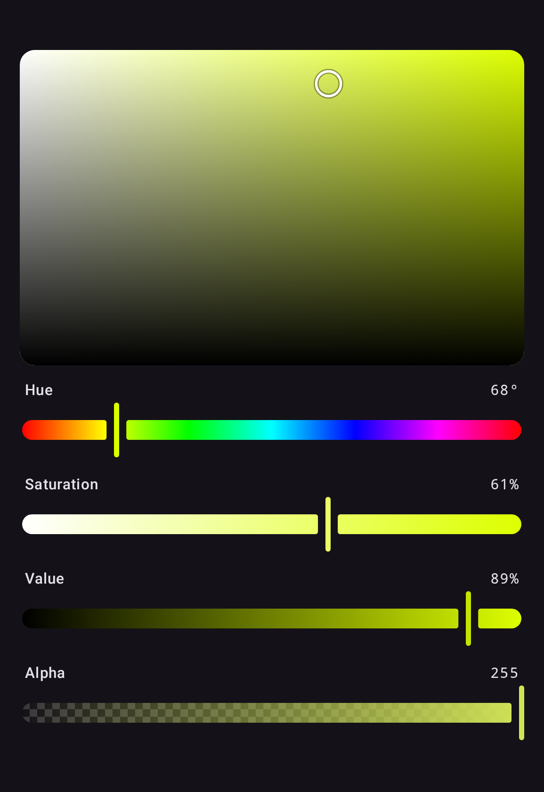
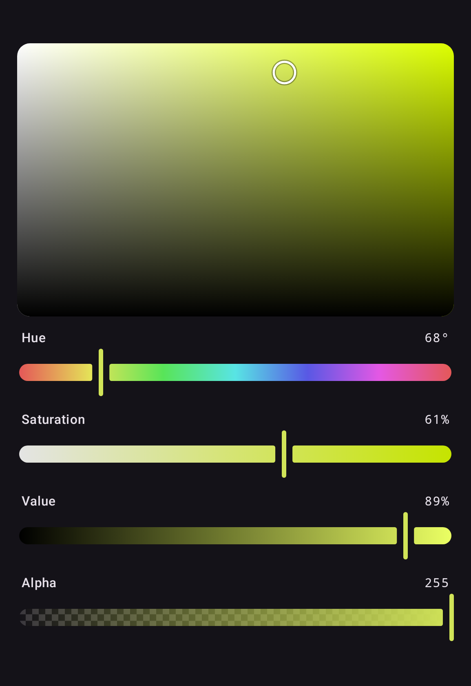
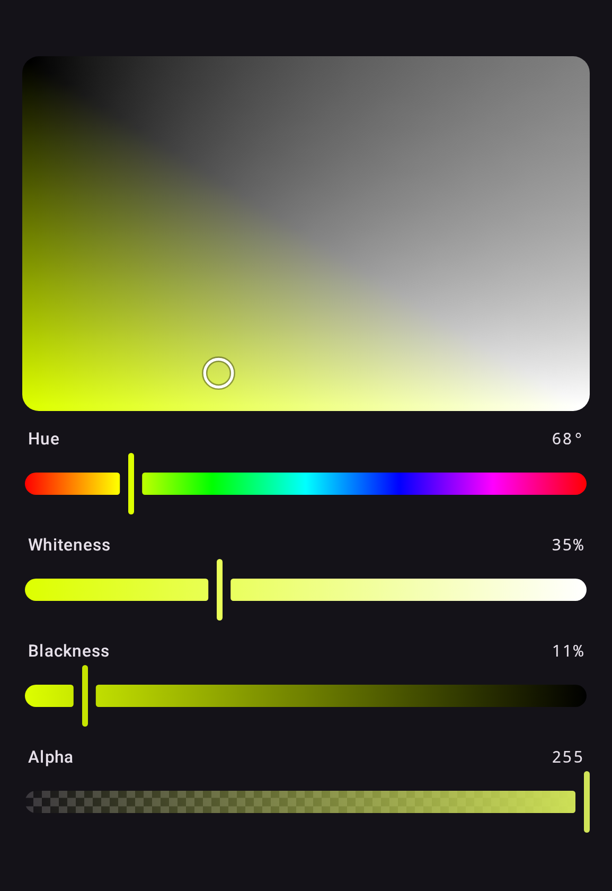
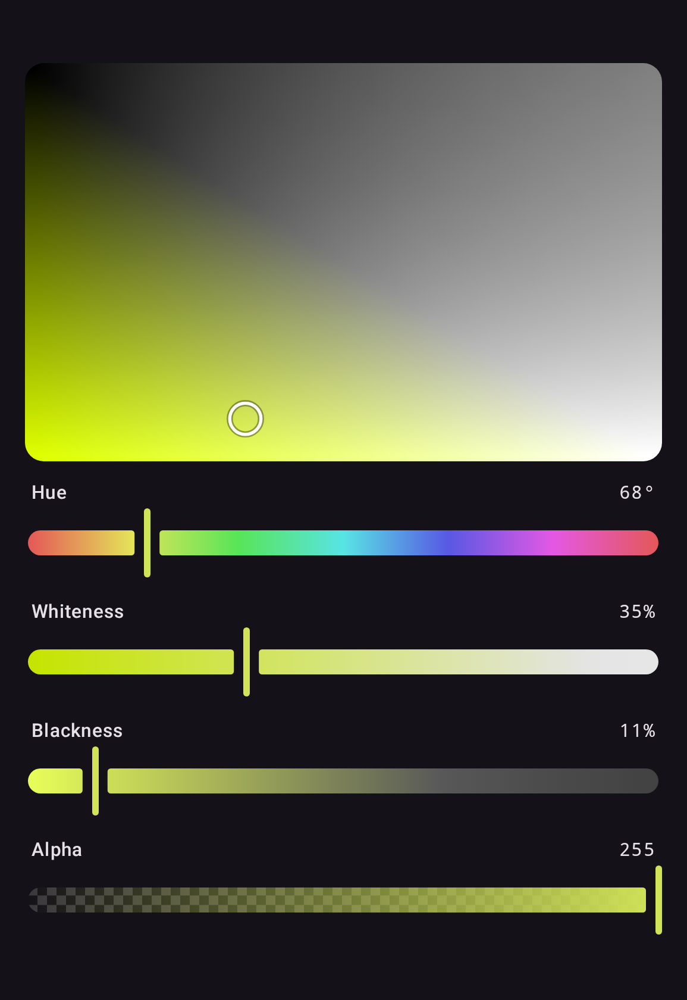
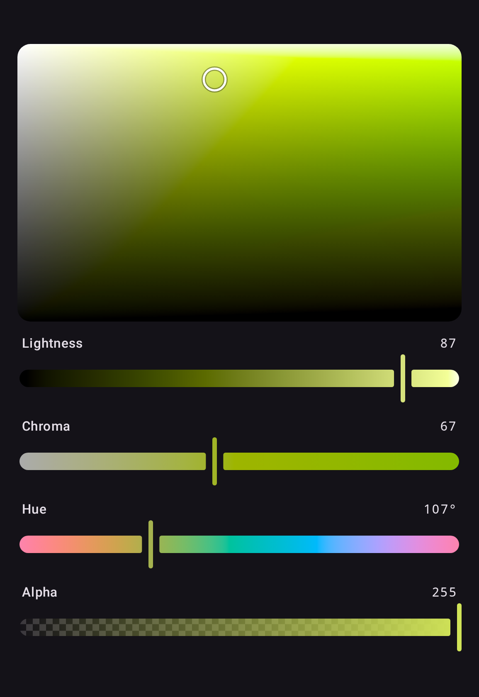
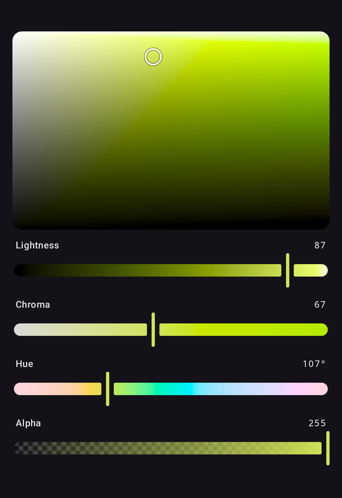
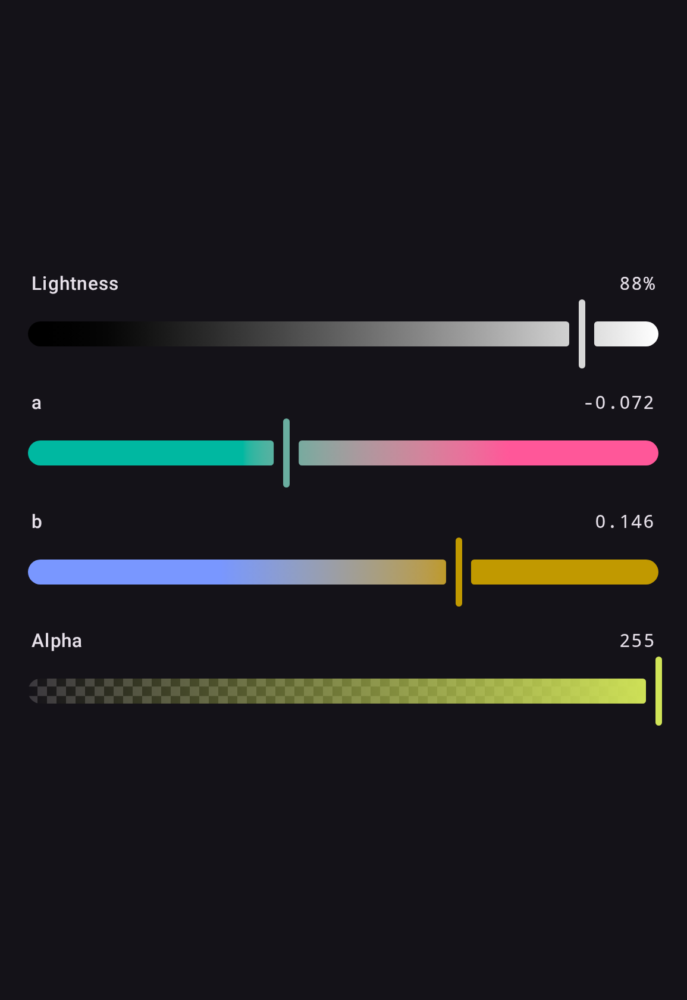
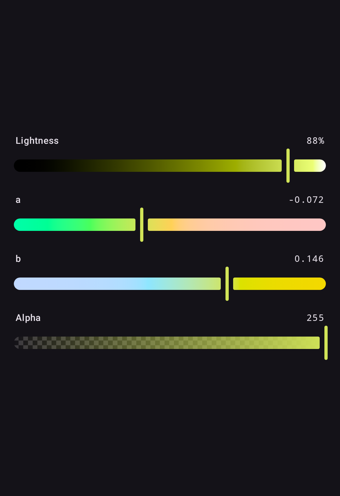
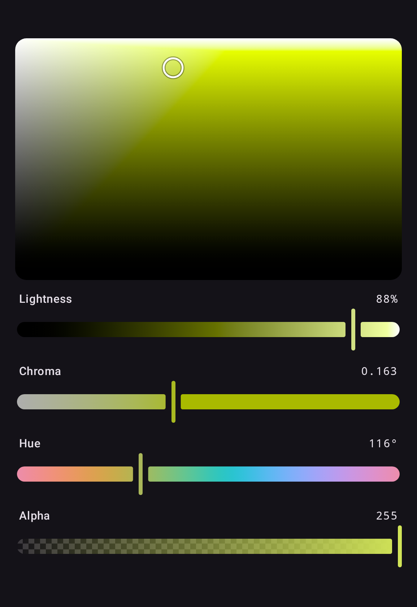

# anyColorPicker — Compose Multiplatform Color Picker

Kotlin Multiplatform color picker library for Android, iOS, Desktop (JVM), and Web (Wasm), built with Compose Multiplatform and Material 3.

> **This README describes 2.0, which is not released yet.** The latest release is 1.2.1, documented at the [v1.2.1 tag](https://github.com/side-codes/anyColorPicker/tree/v1.2.1#readme). [Migrating from 1.x](#-migrating-from-1x) maps one API onto the other.

## ✨ Features

- Compose Multiplatform (Android, iOS, Desktop/JVM, Web/Wasm)
- A picker for any color space: the fifteen built in — sRGB, linear sRGB, Display P3, XYZ D65 and D50, Lab, LCH, Oklab, OkLCh, HSL, HWB, HSV, Okhsl, Okhsv and CMYK — and any an app defines
- Eleven ready-made pickers, each over a `ColorPickerState`, a `ColorValue` or a Compose `Color`
- A color model built on CSS Color 4: a `ColorValue` keeps the space it was written in, its `none` components and any value outside sRGB
- CSS color strings and hex, both ways
- CSS Color 4 gamut mapping, so a color outside sRGB is drawn with its lightness and hue intact
- A grey keeps its hue: dragged to grey and back, a color returns in the hue it had rather than red
- Two-dimensional planes over any two channels of a space
- Alpha channel support
- Color picker dialog
- Material 3 theming via `ColorPickerDefaults` and `ColorPickerTheme`
- Accessibility semantics throughout — sliders step by each channel's own unit, and planes take focus, move with the arrow keys, and offer a screen reader one named action per direction
- RTL layout support everywhere but the planes, which map a color space rather than showing progress

## 📦 Setup

```kotlin
// build.gradle.kts
implementation("codes.side:colorpicker:2.0.0")
```

In a Kotlin Multiplatform project, add it to `commonMain`:

```kotlin
kotlin {
    sourceSets {
        commonMain.dependencies {
            implementation("codes.side:colorpicker:2.0.0")
        }
    }
}
```

It brings two smaller modules with it, which also work on their own:

| Artifact                   | Holds                                                                                       |
|----------------------------|---------------------------------------------------------------------------------------------|
| `codes.side:color`         | `ColorValue`, the color spaces, conversion, gamut mapping, CSS strings and hex. No Compose. |
| `codes.side:color-compose` | `ColorValue.toComposeColor()` and `Color.toColorValue()`.                                   |

Published targets: `android`, `jvm`, `iosArm64`, `iosSimulatorArm64`, `wasmJs`.

## 🎨 Gallery

Every picker takes a `ColoringMode`. `Independent` shows each channel's full range;
`Contextual` previews the resulting color at every slider position. A picker over a space
with a hue defaults to `Independent`; the RGB, Lab, Oklab and CMYK pickers default to
`Contextual`.

| Space                           | Independent                                        | Contextual                                       |
|---------------------------------|----------------------------------------------------|--------------------------------------------------|
| **RGB**<br>`RgbColorPicker`     |      |      |
| **HSL**<br>`HslColorPicker`     |      |      |
| **HSV**<br>`HsvColorPicker`     |      |      |
| **HWB**<br>`HwbColorPicker`     |      |      |
| **Lab**<br>`LabColorPicker`     |      |      |
| **LCH**<br>`LchColorPicker`     |      |      |
| **Oklab**<br>`OklabColorPicker` |  |  |
| **OkLCh**<br>`OkLchColorPicker` |  |  |
| **Okhsl**<br>`OkhslColorPicker` |  |  |
| **Okhsv**<br>`OkhsvColorPicker` |  |  |
| **CMYK**<br>`CmykColorPicker`   |    |    |

`ColorSwatch` draws the color over a transparency checkerboard, so alpha reads correctly:


These images are the Compose Preview Screenshot Testing references, rendered from the
library's own components and re-checked on every CI run, so they cannot drift from what
the code actually draws. Regenerate them with
`./gradlew :screenshot-tests:updateDebugScreenshotTest`.

## 🚀 Quick Start

```kotlin
@Composable
fun MyScreen() {
    val state = rememberColorPickerState(Okhsl(250.0, 0.8, 0.6))

    Column {
        ColorPicker(state)
        ColorSwatch(color = state.color, modifier = Modifier.size(48.dp))
    }
}
```

`ColorPicker` is an Okhsl picker unless given a `space`: its lightness is perceived lightness and
its saturation is measured against the display, so every position is a color the screen shows.
`ColorPicker(state, space = OkLch)` picks in any other space, and the named pickers,
`HslColorPicker` to `CmykColorPicker`, fix one.

A picker can equally sit over a value you hold yourself:

```kotlin
var color by remember { mutableStateOf(Color(0xFF3366CC)) }

HslColorPicker(color = color, onColorChange = { color = it })
```

## 🌈 The Color Model

A `ColorValue` is a color in one space: that space's components, in its own units, and an alpha.
Each space builds one:

```kotlin
val teal = Okhsl(200.0, 0.8, 0.5)            // hue, saturation, lightness
val halfRed = Srgb(1.0, 0.0, 0.0, 0.5)       // alpha comes last
val vivid = OkLch(0.7, 0.3, 150.0)           // more chroma than sRGB can show

teal.space                  // Okhsl
teal[Okhsl.L]               // 0.5
teal.to(OkLch)              // the same color, in OkLCh
teal.with(Okhsl.L, 0.7)     // lighter, and still Okhsl
teal.withAlpha(0.5)
```

A value stays in its space until you convert it, so an OkLCh chroma of 0.3 or a Display P3 red
is kept as it is, and only drawing it maps it into what the screen can show. A component can be
`null`, CSS's `none`: a grey's hue is missing rather than 0, because it has none.

The units are CSS's, so a number copied from a stylesheet or a design tool means the same here:

| Space                             | Channels                                    | Units                                          |
|-----------------------------------|---------------------------------------------|------------------------------------------------|
| `Srgb`, `SrgbLinear`, `DisplayP3` | `R`, `G`, `B`                               | 0–1, and past it for a color outside the gamut |
| `XyzD65`, `XyzD50`                | `X`, `Y`, `Z`                               | the white's `Y` is 1                           |
| `Lab`                             | `L`, `A`, `B`                               | L 0–100; a and b about ±125                    |
| `Lch`                             | `L`, `C`, `H`                               | L 0–100, C 0–150, H 0–360                      |
| `Oklab`                           | `L`, `A`, `B`                               | L 0–1; a and b about ±0.4                      |
| `OkLch`                           | `L`, `C`, `H`                               | L 0–1, C 0–0.4, H 0–360                        |
| `Hsl`, `Hsv`, `Hwb`               | `H`, `S`, `L`; `H`, `S`, `V`; `H`, `W`, `B` | H 0–360, the rest 0–100                        |
| `Okhsl`, `Okhsv`                  | `H`, `S`, `L`; `H`, `S`, `V`                | H 0–360, the rest 0–1                          |
| `Cmyk`                            | `C`, `M`, `Y`, `K`                          | 0–1                                            |

### Which space

- **Okhsl** is Björn Ottosson's perceptual replacement for HSL, and the one to reach for if you
  are choosing between the two. Lightness is perceived lightness, so a blue and a yellow at `0.5`
  look equally light; in HSL they differ by more than half the scale. Saturation is measured
  against the sRGB gamut, so `1` is as colorful as the display can go at that hue and lightness —
  every coordinate is a real color and no part of a slider is dead travel.
- **Okhsv** has Okhsl's perceptual hue and gamut-relative saturation in the HSV arrangement
  artists expect: full saturation at full value is the most vivid form of a hue, and pulling value
  down darkens toward black. Prefer Okhsl when the middle of the lightness track should be a mid
  tone.
- **Oklab** is the perceptual space the two above are built on, and the one to interpolate,
  compare or blend in: equal steps are close to equal perceived steps, and moving `L` does not drag
  the perceived hue with it. **OkLCh** is its cylindrical form, CSS's `oklch()`, for changing one
  of lightness, chroma and hue while holding the others. Neither is bounded by the display, so most
  of their range lies outside sRGB and is drawn as the nearest color sRGB holds.
- **Lab** and **LCH** are CIELAB with a D50 white, which is what CSS `lab()`, Photoshop and
  Compose's `ColorSpaces.CieLab` all quote, so a value copied from any of them means here what it
  meant there. About an eighth of the a–b square is inside sRGB.
- **HSL**, **HSV** and **HWB** are CSS's formulas over sRGB.
- **CMYK** is the naive conversion, with no color profile. It round-trips on screen and is not
  what a press will print — real CMYK is device dependent, its gamut is not sRGB's, and crossing
  between them needs an ICC profile and a rendering intent. Treat it as a screen-space
  parameterisation rather than ink.
- **sRGB**, **linear sRGB**, **Display P3** and **XYZ** are there for interchange, and
  `ColorPicker(state, space = DisplayP3)` puts sliders on any of them.

### An app's own spaces

```kotlin
val brandHsl = ColorSpace.hsl("--brand-hsl", over = DisplayP3)

ColorPicker(state, space = brandHsl)   // a plane and H, S and L sliders, over Display P3
```

`ColorSpace.rgb`, `hsl`, `hsv`, `hwb` and `polar` build one. Its id is a CSS custom name, so
`toCssString` writes it as `color(--brand-hsl …)`, and `parseCss` reads that back when the space is
among those it is given.

### Gamut mapping

Drawing a color outside sRGB does not clamp each channel independently, which would shift
lightness and hue as a side effect. It runs the [CSS Color 4 algorithm](https://www.w3.org/TR/css-color-4/#gamut-mapping):
binary search down the chroma axis, comparing each candidate against its clipped form, and stop
once the two are within a just-noticeable difference. Lightness and hue survive and chroma pays.

```kotlin
val vivid = OkLch(0.7, 0.3, 150.0)

vivid.isInGamut(Srgb.gamut)                     // false
vivid.toGamut(Srgb.gamut)                       // the same lightness and hue, less chroma
vivid.toGamut(Srgb.gamut, GamutMapping.Clip)    // each channel clipped, when that is what you want
vivid.toComposeColor()                          // mapped as toGamut maps it
```

The search runs in Oklab whatever space the color came from, as CSS specifies, so what survives is
Oklab's lightness and hue, not CIELAB's. Okhsl and Okhsv never need it: their saturation is
measured against the gamut, so they are inside it by construction.

### CSS and hex

```kotlin
OkLch(0.7, 0.15, 140.0).toCssString()     // "oklch(0.7 0.15 140)"
Hsl(120.0, 50.0, 25.0).toCssString()      // "hsl(120 50% 25%)"
Okhsl(120.0, 0.5, 0.25).toCssString()     // "color(--okhsl 120 0.5 0.25)"
Hsl(120.0, 50.0, null).toCssString()      // "hsl(120 50% none)"

ColorValue.parseCss("oklch(70% 0.15 140 / 50%)")   // an OkLCh value at half alpha
ColorValue.parseCssOrNull("not a color")           // null, never throws
```

A value is written in its own space and never mapped into a gamut, so a Display P3 red stays
`color(display-p3 1 0 0)`. The library's HSV, Okhsl, Okhsv and CMYK and an app's spaces are
written as `color(--name …)`, which `parseCss` reads back.

Hex is always sRGB, eight bits a channel, mapped into the gamut first:

```kotlin
val blue = Srgb(0.2, 0.5, 0.8)

blue.toHexString(HexAlpha.First)    // "#FF3380CC", as android.graphics.Color writes it
blue.toHexString(HexAlpha.Last)     // "#3380CCFF", as CSS writes it
blue.toHexString(HexAlpha.None)     // "#3380CC"

ColorValue.parseHex("#3380CC", HexAlpha.None)          // throws on invalid input
ColorValue.parseHexOrNull("#ABC", HexAlpha.None)       // shorthand, expands to #AABBCC
```

Four and eight hex digits carry an alpha channel and cannot tell you at which end —
`#FF000080` is a half-transparent red to a stylesheet and an opaque navy to
`android.graphics.Color`. Neither end has a default, so a round trip names the same ordering
twice and the pair reads off one screen:

```kotlin
val stored = blue.toHexString(HexAlpha.First)
ColorValue.parseHexOrNull(stored, HexAlpha.First)          // the color that went in

ColorValue.parseHexOrNull("#FF000080", HexAlpha.First)     // opaque navy, as Android reads it
ColorValue.parseHexOrNull("#FF000080", HexAlpha.Last)      // half-transparent red, as CSS reads it
ColorValue.parseHexOrNull("#FF000080", HexAlpha.None)      // null: the opaque forms only
```

Three and six digits carry no alpha, so they mean the same thing whichever you name.

### Compose colors

```kotlin
val color: Color = teal.toComposeColor()     // mapped into sRGB, as toGamut maps it
val value: ColorValue = color.toColorValue() // sRGB, or the Compose color space it is in
```

A Compose `Color` in Display P3 or another of Compose's RGB spaces arrives in that space, not
clipped into sRGB.

## 🧩 Color Picker Components

### Pickers

```kotlin
val state = rememberColorPickerState(Okhsl(250.0, 0.8, 0.6))

ColorPicker(state)                          // Okhsl: a plane, three sliders and alpha
ColorPicker(state, space = OkLch)           // any space, the library's or an app's
OkLchColorPicker(state)                     // the same, by name
ColorPicker(
    state = state,
    space = Cmyk,
    showAlpha = false,
    coloringMode = ColoringMode.Independent,
)
```

A picker draws a plane when its space has one hue and two other channels, then a slider for each
channel in the space's order, then alpha. The plane runs across the channel that measures
colorfulness and up the other: HSL's S × L, HSV's S × V, HWB's W × B, LCH's and OkLCh's C × L,
Okhsl's S × L and Okhsv's S × V. Moving any part leaves the color in the picker's space.

The eleven named pickers are `RgbColorPicker` (sRGB), `HslColorPicker`, `HsvColorPicker`,
`HwbColorPicker`, `LabColorPicker`, `LchColorPicker`, `OklabColorPicker`, `OkLchColorPicker`,
`OkhslColorPicker`, `OkhsvColorPicker` and `CmykColorPicker`. Each is `ColorPicker` with its
space fixed and takes the same parameters.

Every part of a picker is a slot, handed the state, and for a slider the channel. Replace one to
relabel it — which is how a picker is localized, since the library ships no strings of its own:

```kotlin
HslColorPicker(
    state = state,
    channelSlider = { state, channel ->
        if (channel === Hsl.H) {
            val hue = stringResource(Res.string.hue)
            ChannelSlider(state, channel, label = { SliderLabel(hue) }, semanticLabel = hue)
        } else {
            ChannelSlider(state, channel)
        }
    },
)
```

A replacement inherits the picker's colors, shapes and dimensions through the theme, so only
what you actually want to change has to be named. `enabled` is the exception — forward it if
you want your slider dimmed, though the picker refuses input to a disabled slot either way:

```kotlin
HslColorPicker(state = state, enabled = false)   // dimmed, inert, and disabled to a screen reader
```

`thumb` reaches every slider in the picker, so [the custom thumb below](#custom-thumb) works
here too rather than only on a slider built by hand. `onValueChangeFinished` is called when a
drag ends, and after each key press or screen reader step, whichever part moved.

### Over a value you hold

Every picker also comes in two fully controlled forms, as Compose's `Slider(value, onValueChange)`
is: over a `ColorValue`, and over a Compose `Color`.

```kotlin
var value by remember { mutableStateOf<ColorValue>(Okhsl(250.0, 0.8, 0.6)) }
ColorPicker(value = value, onValueChange = { value = it })

var color by remember { mutableStateOf(Color(0xFF3366CC)) }
OkhslColorPicker(color = color, onColorChange = { color = it })
```

- Every change reaches the callback in the same event, as the whole new value in the picker's
  space, and the picker draws only what you pass back. Ignore the callback and the picker holds
  still; clamp or round the value and it shows the clamp or the rounding at once.
- A value you pass in is drawn, and never reported back to you.
- The `Color` form keeps the exact value behind the last color it reported, so an Okhsl picker
  never steps through 8-bit sRGB, and an edit outside sRGB stays where the user put it. Hold a
  `ColorValue` to keep wide gamut and `none` on your side too.
- A value that arrives late — debounced, from a store, through a coroutine — is drawn when it
  arrives, while a drag carries on from the finger. A caller like that is better served by
  holding a `ColorPickerState` and observing it.

### Channel sliders

`ChannelSlider(state, channel)` is a slider for one channel of any space, and `AlphaSlider(state)`
one for alpha. Compose any set of them against a shared state:

```kotlin
ChannelSlider(state, Okhsl.H)
ChannelSlider(state, OkLch.C)                       // 0 to 0.4, CSS's reference range
ChannelSlider(state, OkLch.C, range = 0.0..0.2)     // a narrower track
ChannelSlider(state, Srgb.R)
AlphaSlider(state)
```

- The thumb sits at the channel's displayed value, so a grey's hue slider shows the hue last
  chosen. A value outside `range`, such as OkLCh chroma 0.5 or extended sRGB, pins the thumb to
  that end while the label keeps its true number; it changes only when the user moves the slider.
- `Contextual` draws each point of the track as the color the slider would make there;
  `Independent` holds the other channels at clear colors of middle lightness. Either way the track
  is computed in the channel's space and brought into sRGB by chroma reduction.
- The arrow keys move by the channel's `step` and Page Up and Page Down by its `pageStep`: a degree
  and ten on a hue, 1/255 and 17/255 on an RGB channel, 0.001 and 0.01 on OkLCh chroma. A screen
  reader steps by `step` too.
- `AlphaSlider` edits alpha alone and keeps the color's space. A missing alpha reads 0, as CSS reads
  `none`.

Sliders expose slots and semantics for customization:

```kotlin
ChannelSlider(
    state = state,
    channel = Hsl.H,
    label = { SliderLabel("Farbton") },          // leading label slot (null to hide)
    valueLabel = { SliderValueLabel("200°") },   // trailing value slot (null to hide)
    semanticLabel = "Farbton",                   // accessibility label
    semanticValueText = "200 Grad",              // accessibility value announcement
)
```

### Color Planes

`ChannelPlane(state, x, y)` picks two channels of one space at once, holding the space's others,
so with a `ChannelSlider` for the rest and an `AlphaSlider` it makes a full picker.

| Plane                                                | Preview                                                                  |
|------------------------------------------------------|--------------------------------------------------------------------------|
| **HSL**<br>`ChannelPlane(state, Hsl.S, Hsl.L)`       |  |
| **Okhsl**<br>`ChannelPlane(state, Okhsl.S, Okhsl.L)` |                                    |
| **Okhsv**<br>`ChannelPlane(state, Okhsv.S, Okhsv.V)` |                                    |

```kotlin
val state = rememberColorPickerState(Hsl(68.0, 72.0, 62.0))

ChannelPlane(state, Hsl.S, Hsl.L, Modifier.fillMaxWidth().height(220.dp))
ChannelSlider(state, Hsl.H)
```

`x` runs left to right and `y` bottom to top, each over its channel's reference range.

HSL's S × L and HSV's S × V are drawn exactly, with two gradients. HSL's is a horizontal
grey-to-hue ramp under a white / transparent / black overlay: the color at lightness L is the
mid-lightness color blended toward white by `2L-1` above the middle and toward black by `1-2L`
below it, which is what compositing the overlay computes. Every other pair has no such identity,
so it is sampled on a grid, measured for each of the library's planes, and drawn scaled. The grid
is rebuilt off the main thread when a held channel changes.

The surface is **not** mirrored in right-to-left layouts, unlike the sliders. It maps a
color space rather than showing progress.

A plane is reachable without a pointer. It takes focus — by tab or by being pressed — and the
arrow keys move each channel by its `step`, or its `pageStep` with Shift held. An arrow it cannot
use, because that edge is already reached, is passed on, so focus can still leave on a device
driven by a D-pad alone. The focus ring is drawn only while the input mode is keyboard, so a
finger that took focus by pressing the surface does not leave one behind. A screen reader has no
gesture for two degrees of freedom, so each direction is offered as a named action instead,
stepping by `pageStep` because an action menu has no modifier key to hold:

```kotlin
ChannelPlane(
    state = state,
    x = Hsl.S,
    y = Hsl.L,
    actionLabels = PlaneActionLabels(          // read aloud, so localize them
        increaseX = "Sättigung erhöhen",
        decreaseX = "Sättigung verringern",
        increaseY = "Helligkeit erhöhen",
        decreaseY = "Helligkeit verringern",
    ),
)
```

Passing `null` drops the actions and leaves the plane readable but not adjustable.

`thumb` replaces the position indicator, and receives the plane's `InteractionSource` — which
carries focus as well as drag, so a replacement can mark keyboard focus the way the default
indicator does, with a second ring:

```kotlin
ChannelPlane(state, Hsl.S, Hsl.L, thumb = { source -> MyIndicator(source) })
```

### Custom Thumb

Every slider takes a `thumb` slot, so the Material 3 thumb can be replaced outright — its
size, shape and stroke are yours rather than a fixed set of dimension parameters. The slot
receives the slider's `InteractionSource`, so a thumb can also react to press and drag.


```kotlin
private val SquareThumbSize = 48.dp   // M3 minimum interactive size

@Composable
fun SquareThumb(color: Color, interaction: InteractionSource) {
    val fill = color.copy(alpha = 1f)
    val shape = RoundedCornerShape(16.dp)
    val ring = lerp(fill, Color.White, 0.6f)

    val dragged by interaction.collectIsDraggedAsState()
    val pressed by interaction.collectIsPressedAsState()
    val elevation by animateDpAsState(if (dragged || pressed) 4.dp else 0.dp)

    Box(
        Modifier
            .size(SquareThumbSize)
            .shadow(elevation, shape)
            .background(ring, shape)
            .padding(5.dp)
            .background(fill, RoundedCornerShape(11.dp))
    )
}

ChannelSlider(
    state = state,
    channel = Okhsl.H,
    thumb = { source -> SquareThumb(state.color, source) },
    thumbWidth = SquareThumbSize,   // so the track leaves room for it
)
```

The thumb needs no state parameter: `state` is already in scope at the call site, so the
composable restyles itself as the color changes. The ring is the fill lifted toward white
rather than a light-or-dark choice made at some luminance threshold — a threshold snaps
visibly the moment a drag crosses it, while this moves with the color. And because the
slot is handed the slider's `InteractionSource`, the thumb can react to being dragged;
that is state a caller cannot otherwise reach, since the source is created inside the
slider.

`thumbWidth` matters. The track breaks around the thumb, and it sizes that break from this
value, defaulting to `ColorPickerDefaults.ThumbWidth` (the Material 3 handle). A wider
thumb that does not declare its width covers the gap and sits flush against the gradient.
`thumbTrackGap` controls the clearance itself. The sample app's *Custom thumb* section runs
exactly this code.

### Color Swatch

Renders a color over a transparency checkerboard:

```kotlin
ColorSwatch(
    color = state.color,
    modifier = Modifier.fillMaxWidth().height(48.dp),
    contentDescription = "Selected color",
)
```

### Dialog

A Material 3 `AlertDialog` with a `ColorPicker` and a live swatch. The value and the callbacks
come first; everything else has defaults:

```kotlin
ColorPickerDialog(
    initialValue = state.value,
    onValueSelected = { value -> state.value = value /* and close */ },
    onDismiss = { /* close */ },
    space = Okhsl,
    title = "Pick a Color",
    confirmText = "Select",
    dismissText = "Cancel",
    showAlpha = true,
)
```

Confirming returns the value in the dialog's space once a channel has moved, and exactly the
initial value if none did, so an untouched Display P3 color is not clipped into sRGB on the way
out. `ColorPickerDialog(initialColor, onColorSelected, onDismiss)` does the same over a Compose
`Color`.

In-progress edits inside the dialog survive configuration changes; passing a new initial value
resets the picker.

The dialog builds its own state, so its slots are handed that state — without it a replacement
would have nothing to read or write, which is what localizing a dialog's sliders needs:

```kotlin
ColorPickerDialog(
    initialValue = state.value,
    onValueSelected = { /* ... */ },
    onDismiss = { /* ... */ },
    channelSlider = { state, channel ->
        if (channel === Okhsl.H) {
            val hue = stringResource(Res.string.hue)
            ChannelSlider(state, channel, label = { SliderLabel(hue) }, semanticLabel = hue)
        } else {
            ChannelSlider(state, channel)
        }
    },
)
```

### Theming

All pickers and components accept `colors` and `shapes` built with `ColorPickerDefaults`, which
derive from `MaterialTheme` by default:

```kotlin
ColorPicker(
    state = state,
    colors = ColorPickerDefaults.colors(
        checkerboardLight = Color.White,
        checkerboardDark = Color.LightGray,
    ),
    shapes = ColorPickerDefaults.shapes(
        trackShape = RoundedCornerShape(4.dp),
        swatchShape = RoundedCornerShape(8.dp),
    ),
)
```

`ColorPickerTheme` sets them for everything inside it instead, which is how a track height
reaches every slider without being a parameter on any of them:

```kotlin
ColorPickerTheme(
    dimensions = ColorPickerDefaults.dimensions(trackHeight = 24.dp),
) {
    ColorPicker(state)
    ChannelPlane(state, Okhsl.S, Okhsl.L)
}
```

A component reads the theme in its parameter defaults, so an explicit argument still wins over
whatever an enclosing `ColorPickerTheme` provided.

## 🔗 State Management

`ColorPickerState` holds the color a picker edits, as one `ColorValue`, and the hues it
remembers beside it.

```kotlin
val state = rememberColorPickerState(Okhsl(250.0, 0.8, 0.6))

state.value                       // the ColorValue, in the space it was last written in
state.color                       // as a Compose Color, mapped into sRGB
state[Hsl.H]                      // one channel, converted; null for a grey's hue
state.displayValue(Hsl.H)         // what a slider shows: for a grey, the hue last chosen
state.hsl.l                       // a typed view; there is one for each of the fifteen spaces

state.value = OkLch(0.7, 0.15, 140.0)
state[Hsl.L] = 40.0               // leaves the color in HSL
state.set(state.okhsl.with(l = 0.4))
state.value = state.value.withAlpha(0.5)

state.isInteracting               // true while a slider or plane is being dragged
```

A grey has no hue, so a hue slider has nothing to show for one. The state remembers the last
hue chosen and shows that, and an edit that makes a grey colorful writes it back, so a color the
user darkened or desaturated comes back in the hue they had rather than red. A grey arriving
without a hue — from hex, a Compose `Color` or an sRGB value — leaves what is remembered alone.
A hue chosen in one space is carried into the others, so an Okhsl slider shows the hue last
picked on an HSL one; that is this library's own rule, as CSS carries no hue across spaces
([csswg-drafts#8484](https://github.com/w3c/csswg-drafts/issues/8484)).

Writing a channel that is out of its limit, or not a number, throws.

`ColorPickerState` has a public constructor, so it can also be created and held outside of
composition (e.g. in a ViewModel). `rememberSaveableColorPickerState` keeps the value, its space
and the remembered hues across configuration changes and process death, on platforms that
restore saved state. A value in an app's own space restores when that space is among the
`knownSpaces` it is given.

## 🏗️ Architecture: A Value Stays in Its Space

Color space conversions lose precision: floats round, and a conversion cannot invent what a
color does not carry — every hue of a grey is the same sRGB color. Industry-standard tools (CSS
Color Level 4, color.js, Sass) solve this the same way we do:

**Store colors in their authored color space. Convert forward only. Never convert back.**

A `ColorValue` is always in one space, and the state holds whichever value was last written or
edited. A slider edits in its own channel's space: the color is converted there once, the channel
is set, and the result stays there. Reading another space converts forward, once, from that
value; nothing is re-derived from a conversion.

```
User drags the OkLCh chroma slider
  -> the value is converted into OkLCh once and its chroma set (the value is now OkLCh)
  -> the Okhsl sliders read it: one conversion, OkLCh -> Okhsl
  -> the OkLCh sliders read it: no conversion at all
```

This means:
- Editing in a space and reading that space back gives **exactly the value set**
- Cross-space reads involve a single forward conversion, never a round-trip
- No precision loss accumulates over time, regardless of how many edits are made
- A value outside sRGB and a `none` component are kept until something writes over them

For more details, see:
- [CSS Color Module Level 4](https://www.w3.org/TR/css-color-4/) -- the W3C spec mandates the same approach
- [Sass Color Spaces](https://sass-lang.com/documentation/values/colors/) -- stores colors in their original space

## ▶️ Running the samples

The same sample app runs on every supported platform:

```sh
./gradlew :sample:desktopApp:run             # desktop window
./gradlew :sample:androidApp:installDebug    # device or emulator
```

`sample/iosApp` holds the SwiftUI entry points. The Xcode project is not checked in, so
it needs creating once on a Mac against the `ComposeApp` framework that `:sample:shared`
produces.

## 🚚 Migrating from 1.x

2.0 replaces 1.x's color classes with `ColorValue` and its per-channel components with ones that
take a channel. The color types live in `codes.side.color`, which `colorpicker` brings with it.

| 1.x                                                                                         | 2.0                                                                                      | Note                                                       |
|---------------------------------------------------------------------------------------------|------------------------------------------------------------------------------------------|------------------------------------------------------------|
| `HslColor(hue = 200f, saturation = 0.8f, lightness = 0.5f)`                                 | `Hsl(200.0, 80.0, 50.0)`                                                                 | CSS's units: HSL's S and L are 0–100                       |
| `RgbColor`, `CmykColor`, `LabColor`, `OkhslColor`, `OkhsvColor`, `OklabColor`, `OklchColor` | `Srgb(…)`, `Cmyk(…)`, `Lab(…)`, `Okhsl(…)`, `Okhsv(…)`, `Oklab(…)`, `OkLch(…)`           | each a `ColorValue`                                        |
| `hsl.toRgb()`, `rgb.toOklch()`, …                                                           | `value.to(Srgb)`, `value.to(OkLch)`                                                      |                                                            |
| `color.toHexString(HexAlpha.First)`                                                         | `value.toHexString(HexAlpha.First)`                                                      |                                                            |
| `"#3380CC".toRgbColorOrNull(HexAlpha.None)`                                                 | `ColorValue.parseHexOrNull("#3380CC", HexAlpha.None)`                                    |                                                            |
| `hsl.toComposeColor()`, `color.toHslColor()`                                                | `value.toComposeColor()`, `color.toColorValue().to(Hsl)`                                 |                                                            |
| `ColorPickerState(initialColor: PickerColor = HslColor())`                                  | `ColorPickerState(initialValue: ColorValue)` or `(initialColor: Color)`                  | no default color                                           |
| `state.hslColor`, `rgbColor`, … (8)                                                         | `state.hsl`, `state.srgb`, … (15 typed views) or `state.value.to(Hsl)`                   | units are CSS's                                            |
| `state.pickerColor`                                                                         | `state.value`                                                                            |                                                            |
| `state.argbInt`                                                                             | `state.color.toArgb()`                                                                   |                                                            |
| `updateHue(h)`, `updateRed(r)`, … (30)                                                      | `state[Hsl.H] = h`, `state[Srgb.R] = r`                                                  | NaN and out-of-limit values throw instead of being ignored |
| `updateFromHsl(hsl)`, …                                                                     | `state.value = x` or `state.set(view)`                                                   |                                                            |
| `updateAlpha(a)`                                                                            | `state.value = state.value.withAlpha(a)`                                                 |                                                            |
| `updateFromArgbInt(i)`                                                                      | `state.value = Color(i).toColorValue()`                                                  |                                                            |
| `HueSlider(state)`, `RedSlider(state)`, … (21)                                              | `ChannelSlider(state, Hsl.H)`, `ChannelSlider(state, Srgb.R)`                            |                                                            |
| `HslPlane`, `OkhslPlane`, `OkhsvPlane`                                                      | `ChannelPlane(state, Hsl.S, Hsl.L)`, …                                                   |                                                            |
| `HslColorPicker(color: HslColor, onColorChange)`                                            | `HslColorPicker(value: ColorValue, onValueChange)` or `(color: Color, onColorChange)`    | fully controlled                                           |
| a caller's value applied when the gesture ends                                              | applied at once; the callback is synchronous                                             |                                                            |
| per-channel slots (`hueSlider = …`)                                                         | `channelSlider = { state, channel -> … }`                                                |                                                            |
| `ColorPickerDialog(onColorSelected: (HslColor) -> Unit, initialColor: HslColor)`            | `ColorPickerDialog(initialValue, onValueSelected, …, space = Okhsl)` or the `Color` form |                                                            |
| a saved 1.x state                                                                           | not restored; the state starts from its initial value                                    |                                                            |
| `randomHslColor()`                                                                          | removed                                                                                  |                                                            |

## 🚚 Migrating from andcolorpicker (0.6.x)

The View-based `codes.side:andcolorpicker` artifact (XML `HSLColorPickerSeekBar` and friends) is discontinued. This library is a full Compose Multiplatform rewrite published under new coordinates:

```diff
- implementation("codes.side:andcolorpicker:0.6.2")
+ implementation("codes.side:colorpicker:2.0.0")
```

There is no 1:1 API mapping — migrate by concept:

| andcolorpicker (View-based)                                    | colorpicker (Compose)                                                                                                              |
|----------------------------------------------------------------|------------------------------------------------------------------------------------------------------------------------------------|
| `HSLColorPickerSeekBar` (`hslMode` = hue/saturation/lightness) | `ChannelSlider(state, Hsl.H)`, `Hsl.S` or `Hsl.L`, or `HslColorPicker` for all three                                               |
| `RGBColorPickerSeekBar`                                        | `ChannelSlider(state, Srgb.R)`, `Srgb.G` or `Srgb.B`, or `RgbColorPicker`                                                          |
| `CMYKColorPickerSeekBar`                                       | `ChannelSlider(state, Cmyk.C)`, `Cmyk.M`, `Cmyk.Y` or `Cmyk.K`, or `CmykColorPicker`                                               |
| `LABColorPickerSeekBar`                                        | `ChannelSlider(state, Lab.L)`, `Lab.A` or `Lab.B`, or `LabColorPicker`                                                             |
| `HSLAlphaColorPickerSeekBar`                                   | `AlphaSlider`                                                                                                                      |
| `PickerGroup` + `registerPickers`                              | Pass one `ColorPickerState` to every component — they stay in sync automatically                                                   |
| `SwatchView`                                                   | `ColorSwatch`                                                                                                                      |
| `OnColorPickListener` / `addListener`                          | Read `state.value` — it is Compose snapshot state, so composition recomposes automatically; use `snapshotFlow` outside composition |
| `IntegerHSLColor` and friends                                  | `ColorValue`, built by its space: `Hsl(200.0, 80.0, 50.0)`                                                                         |
| `hslColoringMode` = `pure` / `output`                          | `ColoringMode.Independent` / `ColoringMode.Contextual`                                                                             |

## 📄 License

```
Copyright 2020 Illia Achour

Licensed under the Apache License, Version 2.0 (the "License");
you may not use this file except in compliance with the License.
You may obtain a copy of the License at

    http://www.apache.org/licenses/LICENSE-2.0

Unless required by applicable law or agreed to in writing, software
distributed under the License is distributed on an "AS IS" BASIS,
WITHOUT WARRANTIES OR CONDITIONS OF ANY KIND, either express or implied.
See the License for the specific language governing permissions and
limitations under the License.
```
