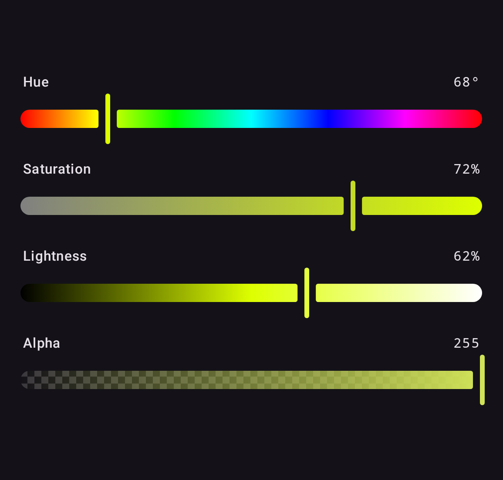
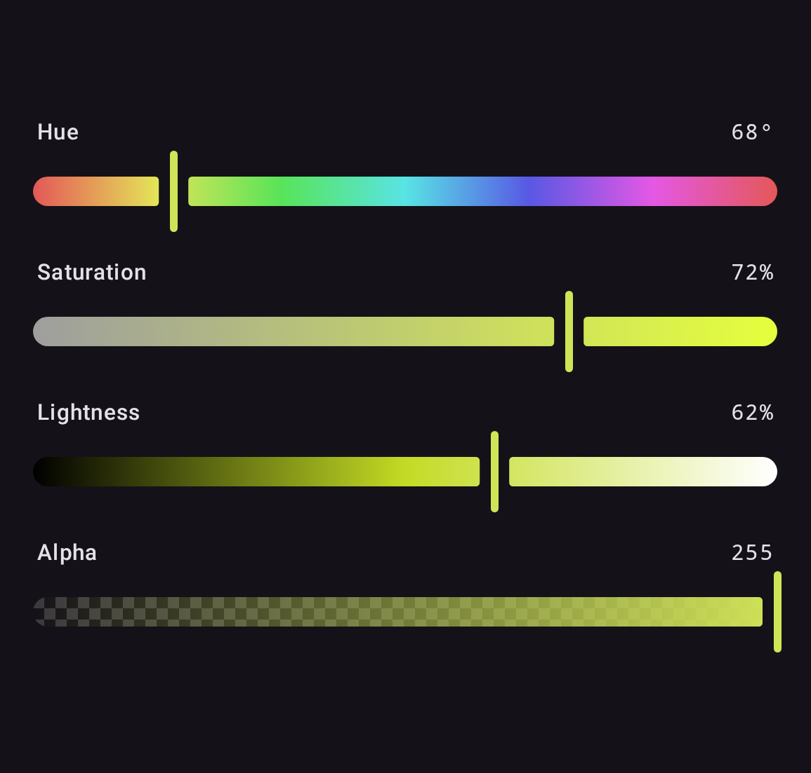
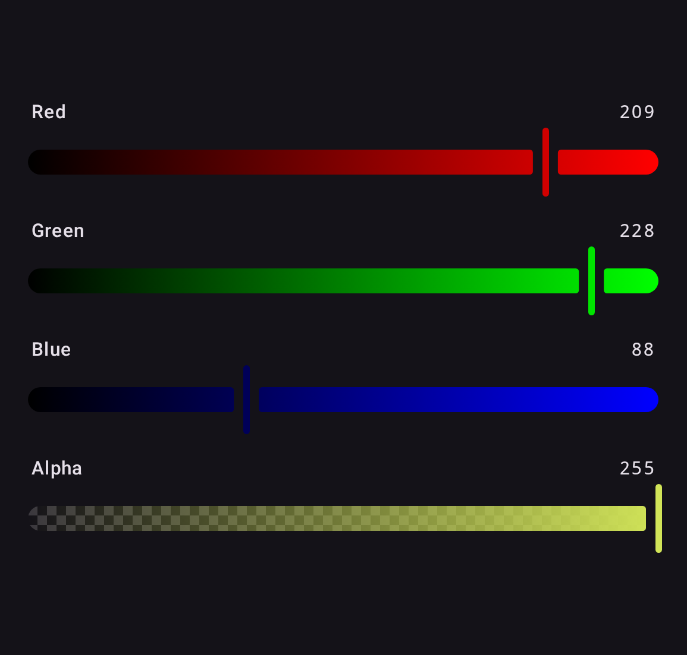
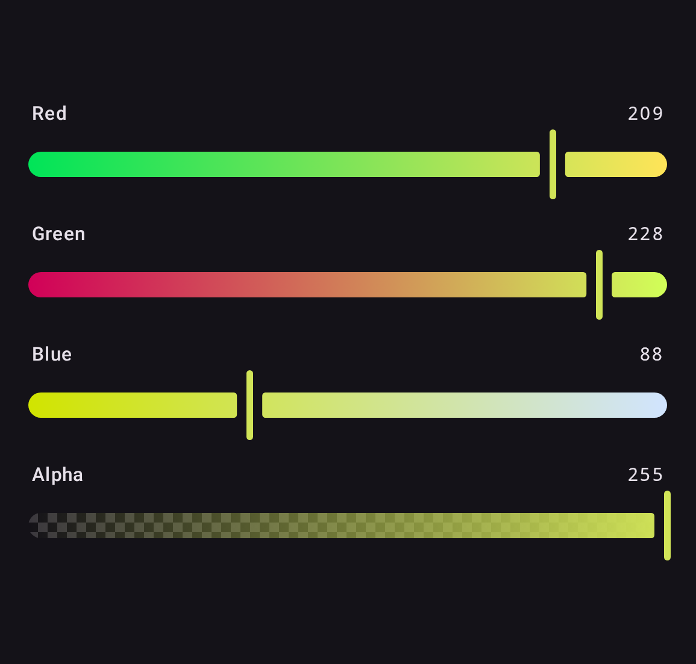
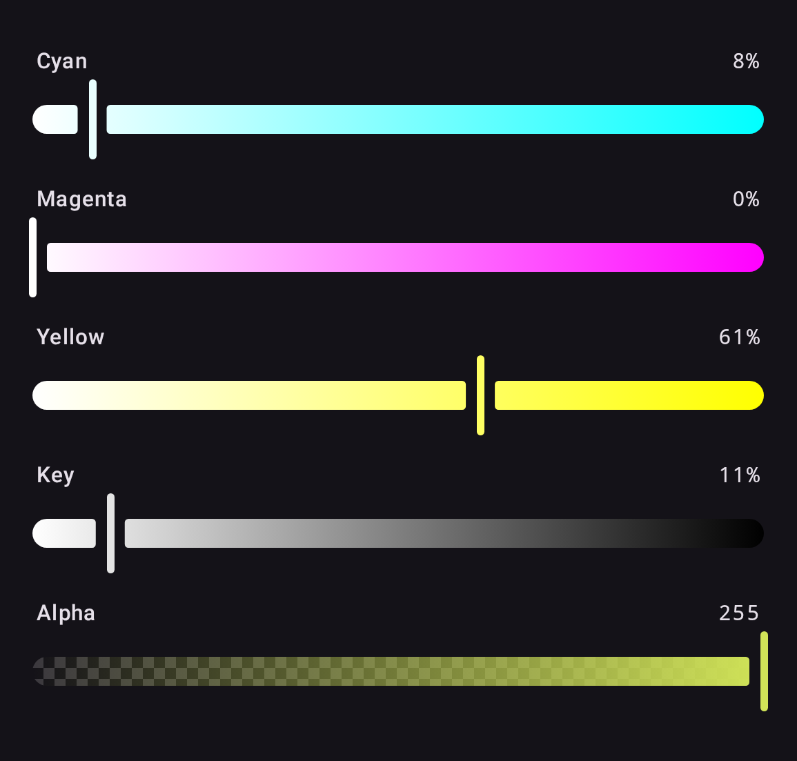
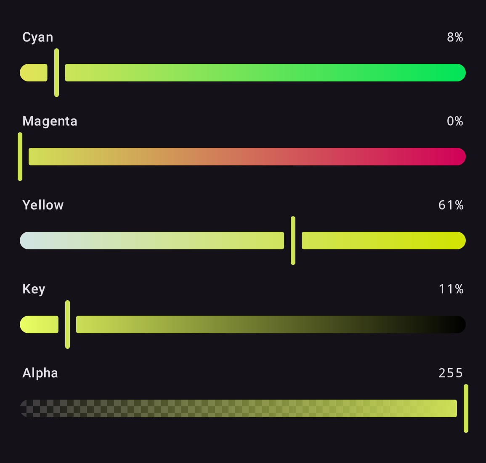
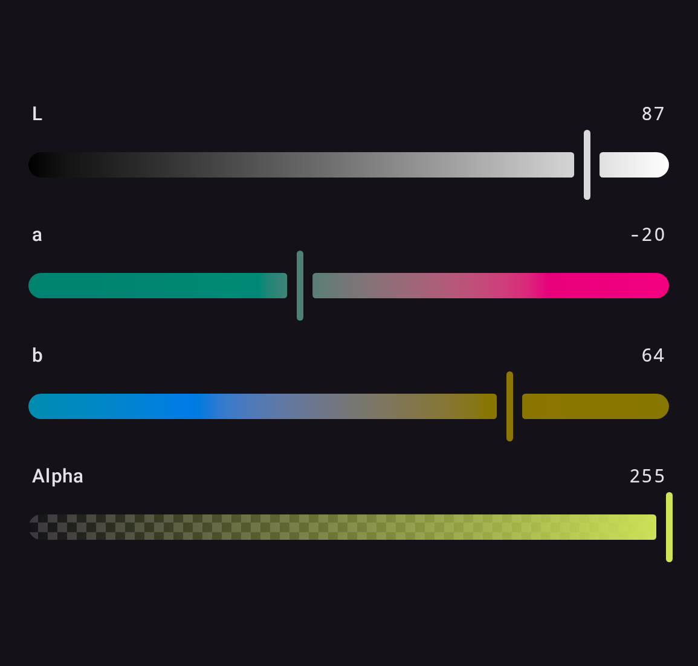
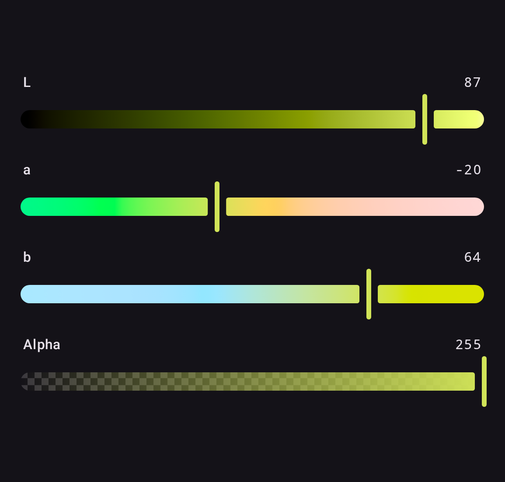
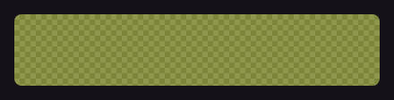
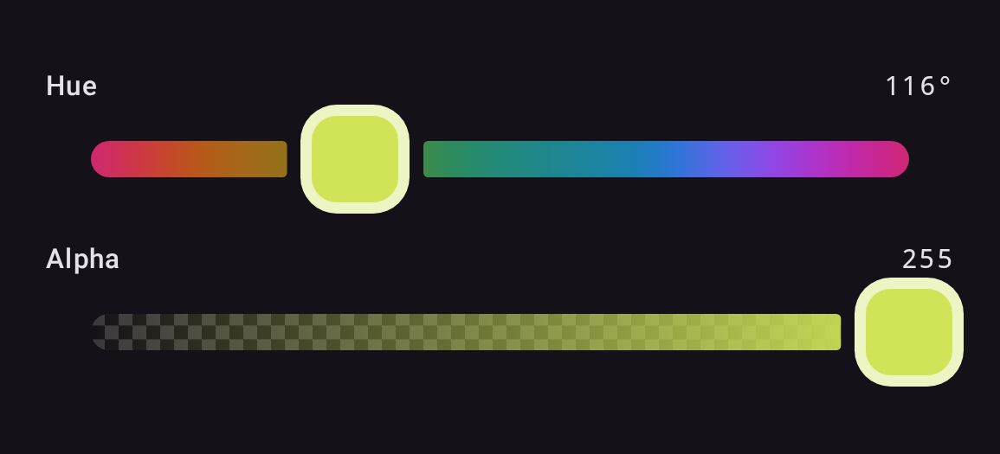

# anyColorPicker — Compose Multiplatform Color Picker

Multiplatform color picker library for Android, iOS, Desktop (JVM), and Web (Wasm), built with Compose Multiplatform and Material 3.

## ✨ Features

- Compose Multiplatform (Android, iOS, Desktop/JVM, Web/Wasm)
- Material 3 theming via `ColorPickerDefaults`
- HSL, RGB, CMYK, and LAB color models
- Alpha channel support
- Zero-drift editing: `ColorPickerState` keeps the authoritative color in the space you edited, so edit-in-X-read-X is always exact (conversions themselves are float-based)
- Unidirectional data flow with `ColorPickerState`
- Hex string parsing and formatting
- Color picker dialog
- Accessibility semantics and RTL layout support

## 📦 Setup

```kotlin
// build.gradle.kts
implementation("codes.side:colorpicker:1.1.0")
```

In a Kotlin Multiplatform project, add it to `commonMain`:

```kotlin
kotlin {
    sourceSets {
        commonMain.dependencies {
            implementation("codes.side:colorpicker:1.1.0")
        }
    }
}
```

Published targets: `android`, `jvm`, `iosArm64`, `iosSimulatorArm64`, `wasmJs`.

## 🎨 Gallery

Every picker takes a `ColoringMode`. `Independent` shows each channel's full range;
`Contextual` previews the resulting color at every slider position. `HslColorPicker`
defaults to `Independent`; the others default to `Contextual`.

| Model                         | Independent                                           | Contextual                                          |
|-------------------------------|-------------------------------------------------------|-----------------------------------------------------|
| **HSL**<br>`HslColorPicker`   |    |    |
| **RGB**<br>`RgbColorPicker`   |    |    |
| **CMYK**<br>`CmykColorPicker` |  |  |
| **LAB**<br>`LabColorPicker`   |    |    |

`ColorSwatch` draws the color over a transparency checkerboard, so alpha reads correctly:



These images are the Compose Preview Screenshot Testing references, rendered from the
library's own components and re-checked on every CI run, so they cannot drift from what
the code actually draws. Regenerate them with
`./gradlew :screenshot-tests:updateDebugScreenshotTest`.

## 🚀 Quick Start

```kotlin
@Composable
fun MyScreen() {
    val state = rememberColorPickerState(
        initialColor = HslColor(hue = 200f, saturation = 0.8f, lightness = 0.5f)
    )

    Column {
        HslColorPicker(state = state)
        ColorSwatch(
            color = state.hslColor.toComposeColor(),
            modifier = Modifier.size(48.dp)
        )
    }
}
```

## 🌈 Color Models

All color models use **Float** for full precision. Integer accessors and factories are provided for convenience.

### HSL

```kotlin
val color = HslColor(hue = 210f, saturation = 0.8f, lightness = 0.5f, alpha = 1f)
// hue: [0, 360], saturation/lightness/alpha: [0, 1]

// Integer accessors
color.intHue        // 210
color.intSaturation // 80
color.intLightness  // 50
color.intAlpha      // 255

// From integers
HslColor.fromInt(hue = 210, saturation = 80, lightness = 50, alpha = 255)
```

### RGB

```kotlin
val color = RgbColor(red = 0.2f, green = 0.5f, blue = 0.8f, alpha = 1f)
// All components: [0, 1]

color.intRed   // 51
color.intGreen // 128
color.intBlue  // 204

RgbColor.fromInt(red = 51, green = 128, blue = 204)
```

### CMYK

```kotlin
val color = CmykColor(cyan = 0.3f, magenta = 0.6f, yellow = 0.1f, key = 0.2f)
// All components: [0, 1]

CmykColor.fromInt(cyan = 30, magenta = 60, yellow = 10, key = 20)
```

### LAB

```kotlin
val color = LabColor(l = 53.23f, a = 80.11f, b = 67.22f)
// l: [0, 100], a: [-128, 127], b: [-128, 127], alpha: [0, 1]

LabColor.fromInt(l = 53, a = 80, b = 67)
```

## 🔄 Conversions

Conversions are extension functions. They operate on floats end to end — nothing is quantized to integers until you explicitly ask for an ARGB `Int` or a hex string. Like any color space conversion, a cross-space round trip is not guaranteed to be bit-exact; the zero-drift guarantee comes from `ColorPickerState`'s origin tracking (see [Architecture](#architecture-zero-drift-color-conversions)).

```kotlin
val hsl = HslColor(hue = 0f, saturation = 1f, lightness = 0.5f)
val rgb = hsl.toRgb()
val cmyk = rgb.toCmyk()
val lab = rgb.toLab()
val argb = rgb.toArgbInt()

// Compose interop, both ways
val composeColor: Color = hsl.toComposeColor()
val backToHsl: HslColor = composeColor.toHslColor()
val backToRgb: RgbColor = composeColor.toRgbColor()
val backToCmyk: CmykColor = composeColor.toCmykColor()
val backToLab: LabColor = composeColor.toLabColor()
```

### Hex strings

```kotlin
val rgb = RgbColor(red = 0.2f, green = 0.5f, blue = 0.8f)

// Formatting: any PickerColor or packed ARGB Int
rgb.toHexString()                          // "#FF3380CC" (#AARRGGBB, alpha first)
rgb.toHexString(includeAlpha = false)      // "#3380CC"
0xFF3380CC.toInt().toHexColorString()      // "#FF3380CC"

// Parsing: accepts #RGB, #RRGGBB, and #AARRGGBB; the '#' is optional
"#3380CC".toRgbColorOrNull()               // RgbColor, alpha defaults to FF
"#ABC".toRgbColorOrNull()                  // shorthand, expands to #AABBCC
"not a color".toRgbColorOrNull()           // null, never throws
"#3380CC".toRgbColor()                     // throws IllegalArgumentException on invalid input
```

## 🧩 Color Picker Components

### Full Pickers

Each color model has a ready-made picker that stacks its channel sliders (plus an optional alpha slider):

```kotlin
val state = rememberColorPickerState()

HslColorPicker(
    state = state,
    showAlpha = true,
    coloringMode = ColoringMode.Independent, // or Contextual
)

RgbColorPicker(state = state, showAlpha = true)
CmykColorPicker(state = state, showAlpha = true)
LabColorPicker(state = state, showAlpha = true)
```

`ColoringMode` controls the slider gradients: `Independent` shows each channel's full range regardless of the other channels, `Contextual` previews the actual resulting color at each position.

### Individual Sliders

Every channel is available as a standalone slider. Compose any subset against a shared state:

```kotlin
// HSL
HueSlider(state = state)
SaturationSlider(state = state)
LightnessSlider(state = state)

// RGB
RedSlider(state = state)
GreenSlider(state = state)
BlueSlider(state = state)

// CMYK
CyanSlider(state = state)
MagentaSlider(state = state)
YellowSlider(state = state)
KeySlider(state = state)

// LAB
LightnessLabSlider(state = state)
LabASlider(state = state)
LabBSlider(state = state)

// Alpha (works with any origin space)
AlphaSlider(state = state)
```

Sliders expose slots and semantics for customization:

```kotlin
HueSlider(
    state = state,
    label = { SliderLabel("Hue") },              // leading label slot (null to hide)
    valueLabel = { SliderValueLabel("200°") },   // trailing value slot (null to hide)
    semanticLabel = "Hue",                       // accessibility label
    semanticValueText = "200°",                  // accessibility value announcement
)
```

### Custom Thumb

Every slider takes a `thumb` slot, so the Material 3 thumb can be replaced outright — its
size, shape and stroke are yours rather than a fixed set of dimension parameters. The slot
receives the slider's `InteractionSource`, so a thumb can also react to press and drag.



```kotlin
private val SquareThumbSize = 48.dp   // M3 minimum interactive size

@Composable
fun SquareThumb(color: Color, interaction: InteractionSource) {
    val fill = color.copy(alpha = 1f)
    val shape = RoundedCornerShape(16.dp)
    val ring = lerp(fill, Color.White, 0.6f)

    val dragged by interaction.collectIsDraggedAsState()
    val pressed by interaction.collectIsPressedAsState()
    val elevation by animateDpAsState(if (dragged || pressed) 4.dp else 0.dp)

    Box(
        Modifier
            .size(SquareThumbSize)
            .shadow(elevation, shape)
            .background(ring, shape)
            .padding(5.dp)
            .background(fill, RoundedCornerShape(11.dp))
    )
}

HueSlider(
    state = state,
    thumb = { source -> SquareThumb(state.hslColor.toComposeColor(), source) },
    thumbWidth = SquareThumbSize,   // so the track leaves room for it
)
```

The thumb needs no state parameter: `state` is already in scope at the call site, so the
composable restyles itself as the color changes. The ring is the fill lifted toward white
rather than a light-or-dark choice made at some luminance threshold — a threshold snaps
visibly the moment a drag crosses it, while this moves with the color. And because the
slot is handed the slider's `InteractionSource`, the thumb can react to being dragged;
that is state a caller cannot otherwise reach, since the source is created inside the
slider.

`thumbWidth` matters. The track breaks around the thumb, and it sizes that break from this
value, defaulting to `ColorPickerDefaults.ThumbWidth` (the Material 3 handle). A wider
thumb that does not declare its width covers the gap and sits flush against the gradient.
`thumbTrackGap` controls the clearance itself. The sample app's *Custom thumb* section runs
exactly this code.

### Color Swatch

Renders a color over a transparency checkerboard:

```kotlin
ColorSwatch(
    color = state.hslColor.toComposeColor(),
    modifier = Modifier.fillMaxWidth().height(48.dp),
    contentDescription = "Selected color",
)
```

### Dialog

A Material 3 `AlertDialog` with an HSL picker and a live swatch. Callbacks come first; everything else has defaults:

```kotlin
ColorPickerDialog(
    onColorSelected = { hsl -> /* confirmed color */ },
    onDismiss = { /* close */ },
    initialColor = HslColor(hue = 200f, saturation = 0.8f, lightness = 0.5f),
    title = "Pick a Color",
    confirmText = "Select",
    dismissText = "Cancel",
    showAlpha = true,
)
```

In-progress edits inside the dialog survive configuration changes; passing a new `initialColor` resets the picker.

### Theming

All pickers and sliders accept `colors` and `shapes` built with `ColorPickerDefaults`, which derive from `MaterialTheme` by default:

```kotlin
HslColorPicker(
    state = state,
    colors = ColorPickerDefaults.colors(
        checkerboardLight = Color.White,
        checkerboardDark = Color.LightGray,
    ),
    shapes = ColorPickerDefaults.shapes(
        trackShape = RoundedCornerShape(4.dp),
        swatchShape = RoundedCornerShape(8.dp),
    ),
)
```

## 🔗 State Management

`ColorPickerState` is the single source of truth. It reads and writes each color space natively, with no round-trip conversions.

```kotlin
val state = rememberColorPickerState()

// Read any color space (derived from the authoritative color)
state.hslColor
state.rgbColor
state.cmykColor
state.labColor
state.argbInt
state.pickerColor // the authoritative color, in whichever space was last written

// Per-channel updates (NaN ignored, values clamped)
state.updateHue(180f)
state.updateSaturation(0.5f)
state.updateLightness(0.5f)
state.updateRed(1f)
state.updateGreen(0f)
state.updateBlue(0f)
state.updateCyan(0.3f)
state.updateMagenta(0.6f)
state.updateYellow(0.1f)
state.updateKey(0.2f)
state.updateLabLightness(50f)
state.updateLabA(20f)
state.updateLabB(-30f)
state.updateAlpha(0.5f) // keeps the current origin space

// Whole-color updates (the written space becomes the origin)
state.updateFromHsl(HslColor(hue = 0f, saturation = 1f, lightness = 0.5f))
state.updateFromRgb(RgbColor(1f, 0f, 0f))
state.updateFromCmyk(cmykColor)
state.updateFromLab(labColor)
state.updateFromArgbInt(0xFFFF0000.toInt())

// True while the user is dragging a slider
state.isInteracting
```

`ColorPickerState` has a public constructor, so it can also be created and held outside of composition (e.g. in a ViewModel).

Use `rememberSaveableColorPickerState()` to keep the state across configuration changes and process death on platforms that provide saved-instance-state support (primarily Android). On other platforms it behaves like `rememberColorPickerState` within the composition. The saver preserves the authoritative color space, not just the visible color.

## 🏗️ Architecture: Zero-Drift Color Conversions

Color space conversions are inherently lossy when values are quantized to integers, and even with floats, transcendental functions (used in LAB) introduce IEEE 754 rounding errors. Industry-standard tools (Photoshop, CSS Color Level 4, Sass) solve this the same way we do:

**Store colors in their authored color space. Convert forward only. Never convert back.**

`ColorPickerState` tracks which color space was last written to (the *origin*). When you read a different space, it converts forward once from the origin. The origin value is never re-derived from a conversion.

```
User drags Red slider
  -> the authoritative color is written as RGB (origin = RGB, zero conversions)
  -> UI reads hslColor -> converts RGB->HSL once (forward only)
  -> UI reads rgbColor -> returns the authoritative RGB value as-is (zero conversions)
```

This means:
- Editing in RGB and reading back RGB produces **the exact original value**
- Editing in HSL and reading back HSL produces **the exact original value**
- Cross-space reads involve a single forward conversion, never a round-trip
- No precision loss accumulates over time, regardless of how many edits are made

For more details, see:
- [CSS Color Module Level 4](https://www.w3.org/TR/css-color-4/) -- the W3C spec mandates the same approach
- [Sass Color Spaces](https://sass-lang.com/documentation/values/colors/) -- stores colors in their original space

## ▶️ Running the samples

The same sample app runs on every supported platform:

```sh
./gradlew :sample:desktopApp:run             # desktop window
./gradlew :sample:androidApp:installDebug    # device or emulator
```

`sample/iosApp` holds the SwiftUI entry points. The Xcode project is not checked in, so
it needs creating once on a Mac against the `ComposeApp` framework that `:sample:shared`
produces.


## 🚚 Migrating from andcolorpicker (0.6.x)

The View-based `codes.side:andcolorpicker` artifact (XML `HSLColorPickerSeekBar` and friends) is discontinued. This library is a full Compose Multiplatform rewrite published under new coordinates:

```diff
- implementation("codes.side:andcolorpicker:0.6.2")
+ implementation("codes.side:colorpicker:1.1.0")
```

There is no 1:1 API mapping — migrate by concept:

| andcolorpicker (View-based)                                    | colorpicker (Compose)                                                                                                                                      |
|----------------------------------------------------------------|------------------------------------------------------------------------------------------------------------------------------------------------------------|
| `HSLColorPickerSeekBar` (`hslMode` = hue/saturation/lightness) | `HueSlider` / `SaturationSlider` / `LightnessSlider`, or `HslColorPicker` for all three                                                                    |
| `RGBColorPickerSeekBar`                                        | `RedSlider` / `GreenSlider` / `BlueSlider`, or `RgbColorPicker`                                                                                            |
| `CMYKColorPickerSeekBar`                                       | `CyanSlider` / `MagentaSlider` / `YellowSlider` / `KeySlider`, or `CmykColorPicker`                                                                        |
| `LABColorPickerSeekBar`                                        | `LightnessLabSlider` / `LabASlider` / `LabBSlider`, or `LabColorPicker`                                                                                    |
| `HSLAlphaColorPickerSeekBar`                                   | `AlphaSlider`                                                                                                                                              |
| `PickerGroup` + `registerPickers`                              | Pass one `ColorPickerState` to every component — they stay in sync automatically                                                                           |
| `SwatchView`                                                   | `ColorSwatch`                                                                                                                                              |
| `OnColorPickListener` / `addListener`                          | Read `state.hslColor` (or any other space) — it is Compose snapshot state, so composition recomposes automatically; use `snapshotFlow` outside composition |
| `IntegerHSLColor` and friends                                  | `HslColor`, `RgbColor`, `CmykColor`, `LabColor` (float-based, with `fromInt` factories)                                                                    |
| `hslColoringMode` = `pure` / `output`                          | `ColoringMode.Independent` / `ColoringMode.Contextual`                                                                                                     |

## 📄 License

```
Copyright 2020 Illia Achour

Licensed under the Apache License, Version 2.0 (the "License");
you may not use this file except in compliance with the License.
You may obtain a copy of the License at

    http://www.apache.org/licenses/LICENSE-2.0

Unless required by applicable law or agreed to in writing, software
distributed under the License is distributed on an "AS IS" BASIS,
WITHOUT WARRANTIES OR CONDITIONS OF ANY KIND, either express or implied.
See the License for the specific language governing permissions and
limitations under the License.
```
